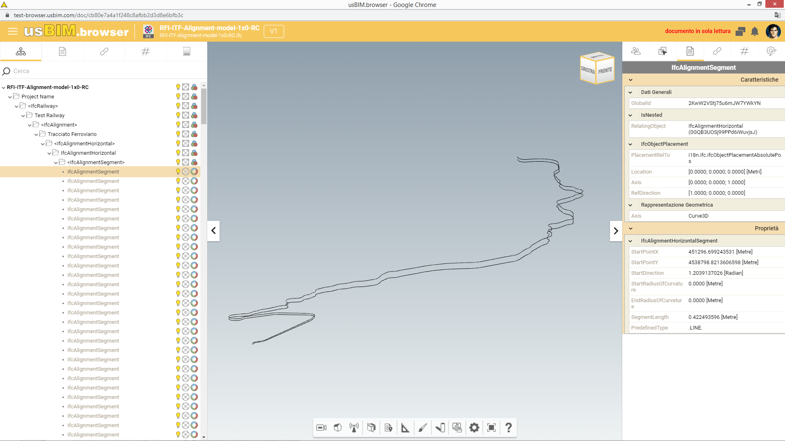
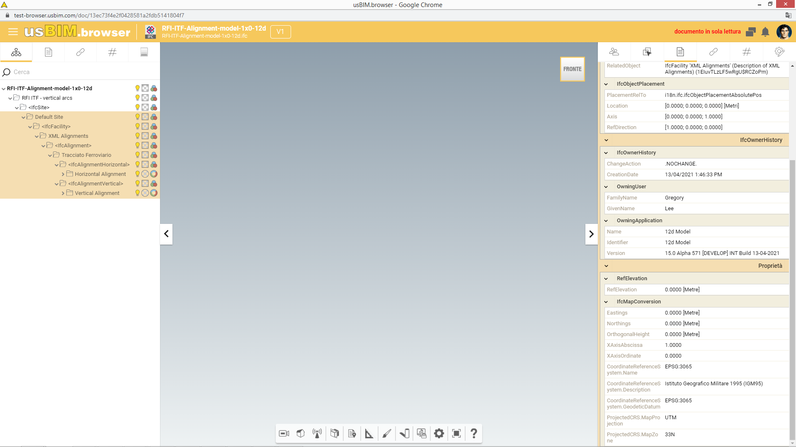

# Railway example by ACCA for RFI & Italferr Storyline

This folder contains IFC files exported by **ACCA software** for the **RFI & Italferr** Storyline 06 (Acquisition and Upgrade of an Existing Railway Line), during the Railway Room project *IFC Rail Phase 2*.

:construction: All files are currently in version IFC4X3 and will be soon updated to the latest version (IFC4X3_ADD1)

## License
This work is licensed under the Creative Commons Attribution 4.0 International License. More info and a link to the full license text is available on http://creativecommons.org/licenses/by/4.0/

## Scope
Among other IFC concepts, these files contain examples of the following topics introduced or modified by IFC4.3:
- Spatial Structure for railway
- Alignment (Horizontal and Vertical. No Cant in this example)
- Linear placement along alignment
- Elements form the Track, Energy, Signalling and Telecommunication domains.

**[Click here](https://service.usbim.com/link/625962438df9e62489e441c5)** to view the 50 km track model

