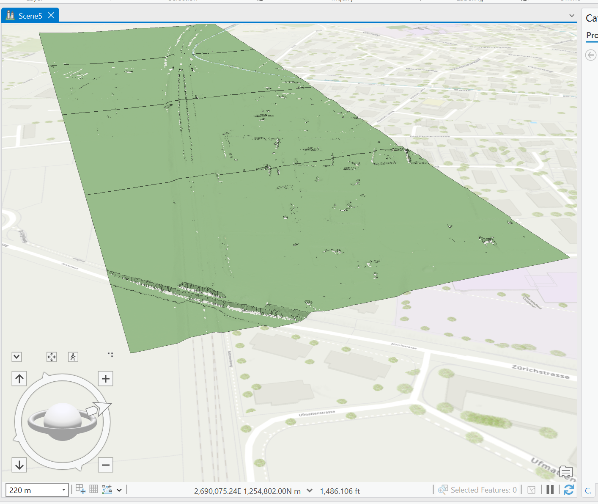
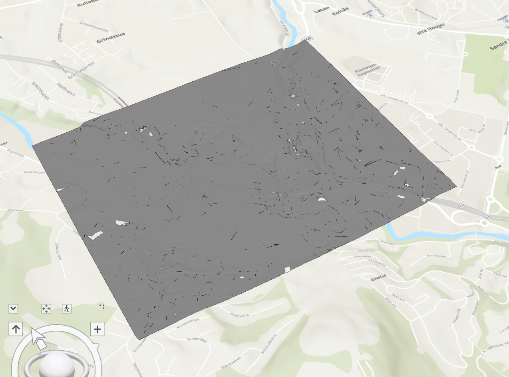
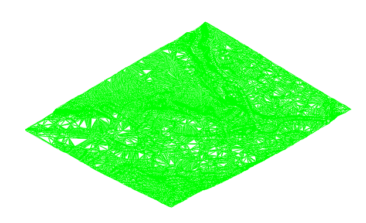
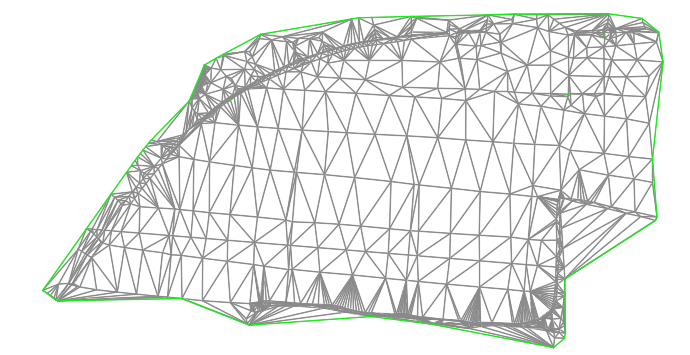
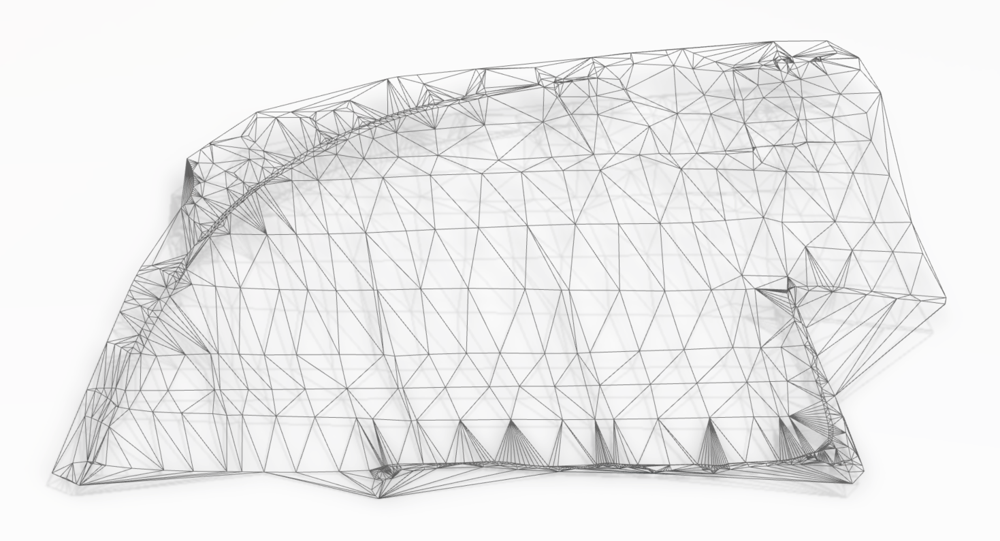
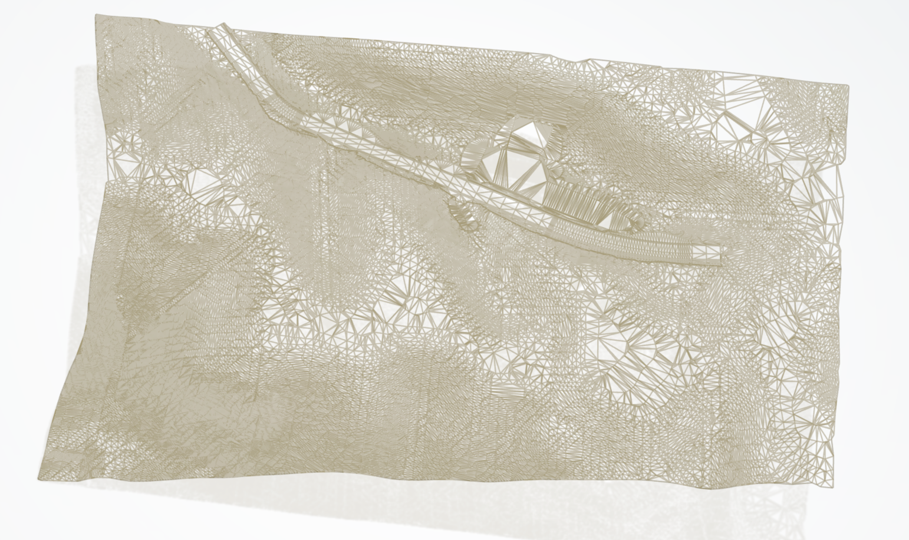
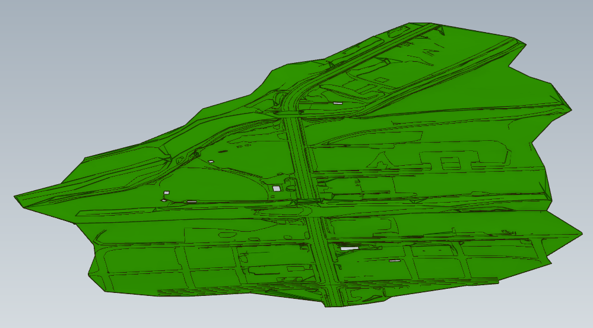

## Note
This folder contains example IFC files, used by the Implementers Forum to deal with the topic of Digital Terrain Modelling (DTM).
> NOTE  If not explicitly stated, these files shall be considered as draft, yet to be validated.
> None of the authors, in any way whatsoever, can be responsible for the use of the information contained in these files.

## Naming convention
Start the file name by identifying the vendor authoring it.

> EXAMPLE `Contoso_terrain-model.ifc`, `Acme_terrain-breps.ifc`

## Files

### [ACCA_terrain-model.ifc](./ACCA/ACCA_terrain-model.ifc.zip)

#### Validation Data

| Validation data | Ref.      | Terrain surface (m2) | Total n. of triangles | (x,y,z) min         | (x,y,z) max |
|-----------------|-----------|----------------------|-----------------------|---------------------|-------------|
| Exporting tool  | [01](#01) | tbd                  | 927866                | 530.5, 1892.5, 9.81 | update      |
| 3DS             | [02](#02) |                      |                       |                     |             |
| Esri            | [03](#03) |                      |                       |                     |             |
| Sogelink        | [04](#04) | tbd                  | 927848                | 279.5, 879.5, 9.8   | update      |
| Trimble         | [05](#05) |                      |                       |                     |             |
| Bentley         | [06](#06) |                      |                       |                     |             |
| Infotech        | [07](#07) |                      |                       |                     |             |
| Adtollo         | [08](#08) | 249250               | 927848                | 279.5, 879.5, 9.81  | update      |

#### Screenshots

##### 01
[Link to model](https://service.usbim.com/link/651eae349242a358bea4321b)

##### 02
...

##### 03

##### 04

##### 05
...

##### 06
...

##### 07
...

##### 08

### [Trimble_terrain-model.ifc](./TrimbleQuadri/Trimble_terrain-model.ifc)

#### Validation Data

| Validation data | Ref.      | Terrain surface (m2) | Total n. of triangles | (x,y,z) min          | (x,y,z) max |
|-----------------|-----------|----------------------|-----------------------|----------------------|-------------|
| Exporting tool  | [09](#09) | 1578901              | 196614                | tbd                  | tbd         |
| 3DS             | [10](#10) |                      |                       |                      |             |
| Esri            | [11](#11) |                      |                       |                      |             |
| Sogelink        | [12](#12) | 1578901.8            | 196614                | 1388.5, 1123.1, 51   | tbd         |
| Acca            | [13](#13) | tbd                  | 196614                | 1388.55, 1123.15, 51 | tbd         |
| Bentley         | [14](#14) |                      |                       |                      |             |
| Infotech        | [15](#15) |                      |                       |                      |             |
| Adtollo         | [16](#16) | 1578901.9            | 196614                | 1388.55, 1123.15, 51 | tbd         |

#### Screenshots

##### 09

##### 10
...

##### 11

##### 12

##### 13
[Link to model](https://service.usbim.com/link/651eb1cb9242a35443a43288)

##### 14
...

##### 15
...

##### 16

### [Sogelink](./Sogelink)

#### Validation Data

| Validation data | Ref.      | Terrain surface (m2) | Total n. of triangles | (x,y,z) min         | (x,y,z) max          |
|-----------------|-----------|----------------------|-----------------------|---------------------|----------------------|
| Exporting tool  | [17](#17) | 107916.8             | 2112                  | 745.4, 4757.1, 72.7 | 1269.8, 5039.3, 93.4 |
| 3DS             | [18](#18) | 107918.044           | 2132                  | tbd                 | tbd                  |
| Esri            | [19](#19) |                      |                       |                     |                      |
| ACCA            | [20](#20) |                      |                       |                     |                      |
| Trimble         | [21](#21) |                      |                       |                     |                      |
| Bentley         | [22](#22) |                      |                       |                     |                      |
| Infotech        | [23](#23) |                      |                       |                     |                      |
| Adtollo         | [24](#24) |                      |                       |                     |                      |

#### Screenshots

##### 17

##### 18

##### 19

##### 20
...

##### 21
...

##### 22
...

##### 23
...

##### 24
...

### [3DS](./3DS/3DS_Terrain-model.ifc)

#### Validation Data

| Validation data  | Ref.      | Terrain surface (m2) | Total n. of triangles | (x,y,z) min | (x,y,z) max |
|------------------|-----------|----------------------|-----------------------|-------------|-------------|
| Exporting tool   | [26](#26) | tbd                  | tbd                   | tbd         | tbd         |
| Importing tool 1 | [27](#27) |                      |                       |             |             |
| Importing tool 2 | ...       |                      |                       |             |             |

#### Screenshots

##### 26

##### 27
...

### [Bentley](./Bentely/Bentley_Terrain.ifc)

#### Validation Data

| Validation data  | Ref.      | Terrain surface (m2) | Total n. of triangles | (x,y,z) min | (x,y,z) max |
|------------------|-----------|----------------------|-----------------------|-------------|-------------|
| Exporting tool   | [40](#40) | tbd                  | tbd                   | tbd         | tbd         |
| Importing tool 1 | [41](#41) |                      |                       |             |             |
| Importing tool 2 | ...       |                      |                       |             |             |

#### Screenshots

##### 40

##### 41
...
