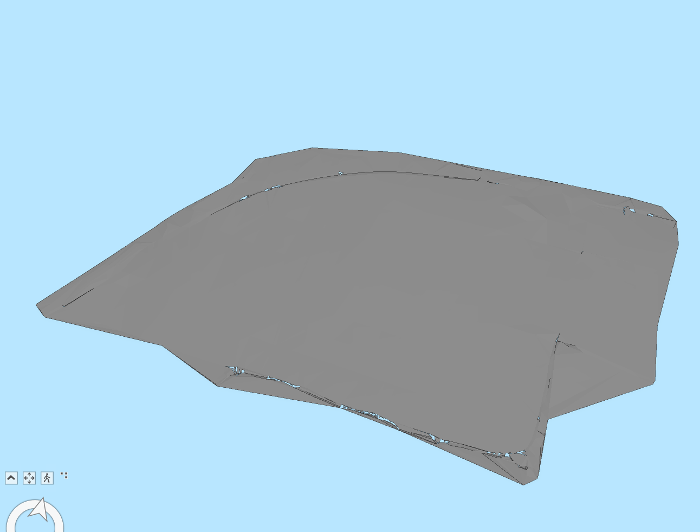

## Note
This folder contains example IFC files, used by the Implementers Forum to deal with the topic of Digital Terrain Modelling (DTM).
> NOTE  If not explicitly stated, these files shall be considered as draft, yet to be validated.
> None of the authors, in any way whatsoever, can be responsible for the use of the information contained in these files.

## Naming convention
Start the file name by identifying the vendor authoring it.

> EXAMPLE `Contoso_terrain-model.ifc`, `Acme_terrain-breps.ifc`

## Files

### [ACCA](./ACCA/ACCA_terrain-model.ifc.zip)

#### Validation Data

| Validation data | Ref.      | Terrain surface (m2) | Total n. of triangles | (x,y,z)min  | (x,y,z)max |
|-----------------|-----------|----------------------|-----------------------|------------------------|-----------------------|
| Exporting tool  | [01](#01) | :x:                  | 927848                | 112.75, 2018.25, -2.18 | 992.25, 1738.75, 7.63 |
| Esri            | [03](#03) | :x:                  | :x:                   | :x:                    | :x:                   |
| Sogelink        | [04](#04) | :x:                  | 927848                | 279.5, 879.5, 9.8      | :x:                   |
| Adtollo         | [08](#08) | 249250               | 927848                | 279.5, 879.5, 9.81     | :x:                   |
| 12d Model       | [09](#09) | 249250.171           | 931612                | 112.75,1738.75,-2.18   | 992.25,2018.25,7.63   |

#### Screenshots

##### 01
[Link to model](https://service.usbim.com/link/651eae349242a358bea4321b)

##### 03

##### 04

##### 08

##### 09

### [Trimble](./TrimbleQuadri/Trimble_terrain-model.ifc)

#### Validation Data

| Validation data | Ref.      | Terrain surface (m2) | Total n. of triangles | (x,y,z)min    | (x,y,z)max    |
|-----------------|-----------|----------------------|-----------------------|--------------------------|--------------------------|
| Exporting tool  | [10](#10) | 1578901              | 196614                | :x:                      | :x:                      |
| Esri            | [12](#12) | :x:                  | :x:                   | :x:                      | :x:                      |
| Sogelink        | [13](#13) | 1578901.8            | 196614                | 1388.5, 1123.1, 51       | :x:                      |
| Acca            | [14](#14) | :x:                  | 196614                | 98279.2, 1.21331e+06, 21 | 99667.7, 1.21218e+06, 72 |
| Adtollo         | [17](#17) | 1578901.9            | 196614                | 1388.55, 1123.15, 51     | :x:                      |
| 12d Model       | [18](#18) | 1578901.858          | 196960                | 98279.18,1212184.98,21   | 99667.73,1213308.13,72   |

#### Screenshots

##### 10

##### 12

##### 13

##### 14
[Link to model](https://service.usbim.com/link/651eb1cb9242a35443a43288)

##### 17

##### 18

### [Sogelink](./Sogelink)

#### Validation Data

| Validation data | Ref.      | Terrain surface (m2) | Total n. of triangles | (x,y,z)min   | (x,y,z)max   |
|-----------------|-----------|----------------------|-----------------------|-------------------------|-------------------------|
| Exporting tool  | [19](#19) | 107916.8             | 2112                  | 745.4, 4757.1, 72.7     | 1269.8, 5039.3, 93.4    |
| 3DS             | [20](#20) | 107918.044           | 2132                  | :x:                     | :x:                     |
| Esri            | [21](#21) | :x:                  | :x:                   | :x:                     | :x:                     |
| ACCA            | [22](#22) | :x:                  | 2132                  | 745.453, 5039.32, 72.73 | 1269.88, 4757.13, 93.39 |
| 12d Model       | [27](#27) | 107918.042           | 2176                  | 745.453,4757.126,72.73  | 1269.88,5039.32,93.39   |

#### Screenshots

##### 19

##### 20

##### 21

##### 22
[Link to model](https://service.usbim.com/link/653bb4ff8e575401308ac958)

##### 27

### [3DS](./3DS/3DS_Terrain-model.ifc)

#### Validation Data

| Validation data  | Ref.      | Terrain surface (m2) | Total n. of triangles | (x,y,z)min       | (x,y,z)max     |
|------------------|-----------|----------------------|-----------------------|-----------------------------|---------------------------|
| Exporting tool   | [28](#28) | 434446.451           | 72640                 | (-427.131,-276.020,181.051) | (427.163,276.018,282.245) |
| ACCA             | [29](#29) | :x:                  | 71702                 | -427.131, 276.018, 181.051  | 427.163, 276.02, 282.245  |
| Esri             | [30](#30) | :x:                  | :x:                   | :x:                         | :x:                       |
| 12d Model        | [31](#31) | 434544.107           | 72684                 | -427.131,-276.020,181.051   | 427.163,276.018,282.245   |

#### Screenshots

##### 28

##### 29
[Link to model](https://service.usbim.com/link/653bb58c8e575406628ac960)

##### 30

##### 31

### [Bentley](./Bentley/Bentley_Terrain.ifc)

#### Validation Data

| Validation data  | Ref.      | Terrain surface (m2) | Total n. of triangles | (x,y,z)min         | (x,y,z)max         |
|------------------|-----------|----------------------|-----------------------|-------------------------------|-------------------------------|
| Exporting tool   | [40](#40) | :x:                  | :x:                   | :x:                           | :x:                           |
| ACCA             | [41](#41) | :x:                  | 12761                 | 492971, 149436, 366.799       | 493395, 148872, 384.064       |
| 3DS              | [42](#42) | 144305.6             | 12761                 | (493000,148900,366.799)       | (493400,149400,384.064)       |
| 12d Model        | [43](#43) | 144302.894           | 12864                 | 492970.934,148872.034,366.799 | 493394.822,149436.427,384.064 |
| Esri             | [44](#44) | :x:                  | :x:                   | :x:                           | :x:                           |

#### Screenshots

##### 40

##### 41
[Link to model](https://service.usbim.com/link/653bb5ce8e575402688ac963)
##### 42

##### 43

##### 44

### [12d Model](./12d/12d_Terrain_model.ifc)

#### Validation Data
| Validation data  | Ref.      | Terrain surface (m2) | Total n. of triangles | (x,y,z)min      | (x,y,z)max      |
|------------------|-----------|----------------------|-----------------------|----------------------------|----------------------------|
| Exporting tool   | [50](#50) | 345748.069           | 4706                  | 42407.035,36815.278,51.837 | 43076.369,37563.532,78.003 |

#### Screenshots

##### 50

