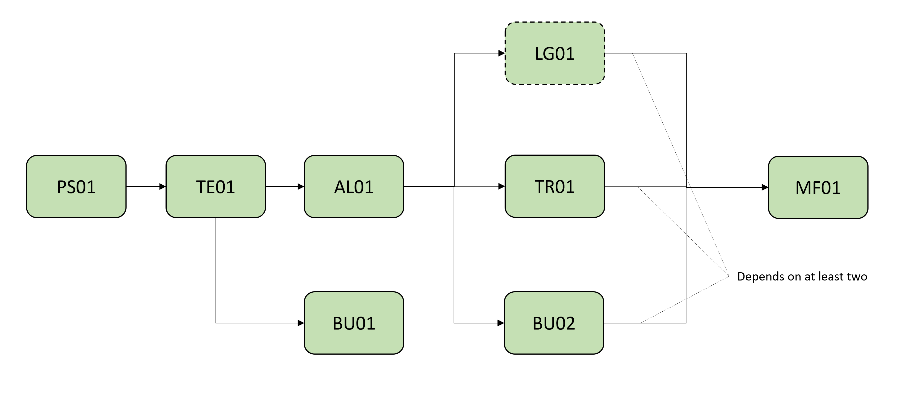
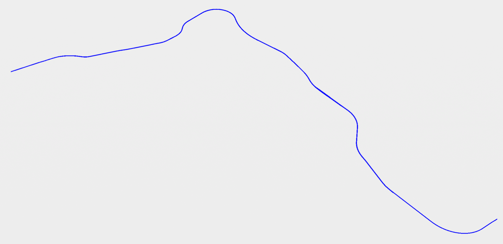

# AL01 - Multiple alignments of railway line

| Test code | Test author     | Test dataset source | Test direction |
|-----------|-----------------|---------------------|----------------|
| MF01      | Mercedes Santos, Chi Zhang             | SBB                 | Export, Import         |

## Intent

This Test belongs to a series of Tests that share a dataset from the same project as a business case. 
The intention of this Business Case is to test how model federation works in the context of IFC4.3. 
In particular we want to test the behaviour of objects that are located in relation to an alignemnt (for example a turnout within an alignment) and in relation to fixed coordinates (for example existing buildings) with georeferencing information set as the global context.
We would also like to test other essential concepts that are related to model federation like project break down structure (or to say, Spatial Structure) and revision and access control for elements.
The series of tests that belong to this Business Cases are listed as follows:

| Test code | Test name     | 
|-----------|-----------------|
| PS01      | Project setup with georeferencing |
| **AL01**      | **Multiple alignments of railway line** |
| LD01      | Loading gauge|
| TR01      | Track panels positioned along alignments |
| BD01      | Building and terrain as existing condition model |
| BD02      | Building positioned along alignment |
| DR01      | Drainage system for railway line |
| MF01      | Model federation|

With this series of tests, we are attempting to build a step-by-step process to realize a business case.
The dependency between them are shown in the following diagram:

To perform a certain test in this series, developers can start from the very beginning (AKA. PS01) to build all the prerequisites independently, or based on outcomes from prerequisites tests.

	
Main IFC concept involved in this test
 

The concept templates that are focused by this series of tests are listed as follows. Specific concept templates that are focused by this test are in Bold.

- [Project Global Positioning](https://ifc43-docs.standards.buildingsmart.org/IFC/RELEASE/IFC4x3/HTML/concepts/Project_Context/Project_Global_Positioning/content.html)
- [**Alignment Layout**](https://ifc43-docs.standards.buildingsmart.org/IFC/RELEASE/IFC4x3/HTML/concepts/Object_Composition/Nesting/Alignment_Layout/content.html)
- [Spatial Structure](https://ifc43-docs.standards.buildingsmart.org/IFC/RELEASE/IFC4x3/HTML/concepts/Object_Connectivity/Spatial_Structure/content.html)
- [Spatial Decomposition](https://ifc43-docs.standards.buildingsmart.org/IFC/RELEASE/IFC4x3/HTML/concepts/Object_Composition/Aggregation/Spatial_Decomposition/content.html)
- [Alignment Geometry](https://ifc43-docs.standards.buildingsmart.org/IFC/RELEASE/IFC4x3/HTML/concepts/Product_Shape/Product_Geometric_Representation/Alignment_Geometry/content.html)
- [Product Linear Placement](https://ifc43-docs.standards.buildingsmart.org/IFC/RELEASE/IFC4x3/HTML/concepts/Product_Shape/Product_Placement/Product_Linear_Placement/content.html)
- [Product Local Placement](https://ifc43-docs.standards.buildingsmart.org/IFC/RELEASE/IFC4x3/HTML/concepts/Product_Shape/Product_Placement/Product_Local_Placement/content.html)
- [Revision Control](https://ifc43-docs.standards.buildingsmart.org/IFC/RELEASE/IFC4x3/HTML/concepts/Object_Attributes/Revision_Control/content.html)
- [Software Identity](https://ifc43-docs.standards.buildingsmart.org/IFC/RELEASE/IFC4x3/HTML/concepts/Object_Attributes/Software_Identity/content.html)
- [Element Decomposition](https://ifc43-docs.standards.buildingsmart.org/IFC/RELEASE/IFC4x3/HTML/concepts/Object_Composition/Aggregation/Element_Decomposition/content.html)
- [Body Tessellation Geometry](https://ifc43-docs.standards.buildingsmart.org/IFC/RELEASE/IFC4x3/HTML/concepts/Product_Shape/Product_Geometric_Representation/Body_Geometry/Body_Tessellation_Geometry/content.html)
- [Body Advanced Swept Solid Geometry](https://ifc43-docs.standards.buildingsmart.org/IFC/RELEASE/IFC4x3/HTML/concepts/Product_Shape/Product_Geometric_Representation/Body_Geometry/Body_AdvancedSweptSolid_Geometry/content.html)
- [Clearance Geometry](https://ifc43-docs.standards.buildingsmart.org/IFC/RELEASE/IFC4x3/HTML/concepts/Product_Shape/Product_Geometric_Representation/Clearance_Geometry/content.html)
- [Object Nesting](https://ifc43-docs.standards.buildingsmart.org/IFC/RELEASE/IFC4x3/HTML/concepts/Object_Composition/Nesting/Object_Nesting/content.html)
- [Product Relative Positioning](https://ifc43-docs.standards.buildingsmart.org/IFC/RELEASE/IFC4x3/HTML/concepts/Object_Connectivity/Product_Relative_Positioning/content.html)

	
Main software features involved in this series of tests
 

- Map coordinate system
- Ownership and revision control
- Model referencing
- Element merging and update
- Model integration and display
- Model filter and hide

## Test dataset (input)

The dataset is made of a LandXML file that has multiple alignments for a section of railway line. The coordinates are defined based on the LV95 ([EPSG 2056](https://epsg.io/2056)) and the vertical datum is LN02 ([EPSG:5728](https://epsg.io/5728)). It has in total 11 alignments and the railway section is about 18 kilometers long. 
An IFC 4.3 reference file is also provided.

| Filename (format)         | Description                                                        |
|---------------------------|--------------------------------------------------------------------|
| BC001_Alignment.xml    |    Data containing track alignments in LandXML format                                   |
| BC001_Alignment.dwg    |    Data containing track alignments in DWG format                                 |
| BC001_Alignment(Reference).ifc    |    Data containing track alignments in IFC 4.3                                  |

## Validation criteria
⚡ For this test case to be considered passed, all criteria listed in this section, and the ones of prerequisites tests shall be verified. ⚡

### Formal rules
Formal Rules are those contained in the Gerkin documentation provided within the bSI validation system. In particular, the following list of rules will apply

#### IFC standard (schema and specification)
When validated using the bSI Validation Service, the IFC must pass:

- Syntax & Schema check
- All following rules:
  - ALB002 - Alignment layout (RI-6)
  - ALB003 - Alignment directions
  - TBD000 - Alignment shape representation (RI-5, RI-9, RI-10, RI-12, RI-14)
  - TBD000 - Stationing along alignment (RI-7)

#### Test case-specific checks

Link to IDS file: STN01.ids 🚧

- (RI-18) Each IfcProduct (and subtypes) must have the attribute Name not null and not empty
- (RI-4) An IfcProject must have the attribute Description not null and not empty
- There must be 1 instance(s) of IfcAlignment and must be named Track alignment,its PredefinedType must be USERDEFINED and its ObjectType must be Railway track alignment
- There must be 1 instance(s) of IfcAlignmentHorizontal and must be named H1
- There must be 1 instance(s) of IfcAlignmentVertical and must be named V1
- There must be 1 instance(s) of IfcAlignmentCant and must be named C1
- There must be 2 instance(s) of IfcSignal and must be named Route Indicator_01, Route Indicator_02
- (RI-8) The horizontal layout must include only the following types of segments: Line, Circular Arc, Clothoid
- (or one step closer to IFC) The PredefinedType of IfcAlignmentHorizontalSegment must be LINE or CIRCULARARC or CLOTHOID
- (RI-11) The vertical layout must include only the following types of segments: Constant Gradient, Circular Arc
- (RI-13) The cant layout must include only the following types of segments: Constant Cant, Linear Transition
- (RI-19) An IfcSignal shall have 'Body' geometry.

### Informal criteria
The following steps should be performed in order to corroborate that the software is working as expected:

- Each file mades up a specialist model. Each model is to be loaded within one IfcFacilityPart.
- All of the models should be first converted into ifc4.3.
- When loaded together, all the models shold be able to be federated into one. An export of the federated model is not required.
- The existing building model should be independent of the other models and the location of its objects based only on its geocoordinates.
- The alignment model should be independent of the other models and the location of its objects based only on its geocoordinates.
- The alignment model should guide the location of both the railway and a gauge model. It should also guide some, but not all, the objects of the drainage model. Geolocation of the "guided" objects should be obtained by transformation within the software but it should not be fixed to any coordinated system.
- The drainage model will contain both fixed and "guided" objects in terms of its location. Georefencing will be both fixed and guided, depending on the type of element.
- The test will consist a correction of the alignment model and the consecuent correction of the guided models.
- We expect an export in ifc4.3 of all models before ans after the correction.

### Expected geometry
>:information_source: *add image of the expected geometry. Upload the jpeg/png file in the Dataset folder of this test*

### Control parameters
>:information_source: *add parameters/data that can be use to support the validation of import into a receiving application. Example: total length of one alignment, coordinates for end point of the alignment.*

- The total 2D length of the track alignment (horizontal projection) is 1029.3721 meters
- The total 3D length of the track alignment is 1029.3861 meters
- The ending point of the track alignment has coordinate (x, y, z) 453202.5241, 4539831.9287, 2.0000
- The ending point of the track alignment has mileage (pk) 0+876.2721
- The vertical height difference between starting and ending points of the track alignment 3D curve is -3.0000 meters

### Link to requirements
>:information_source: *list requirements covered by this test, or refer to external documentation*

...
