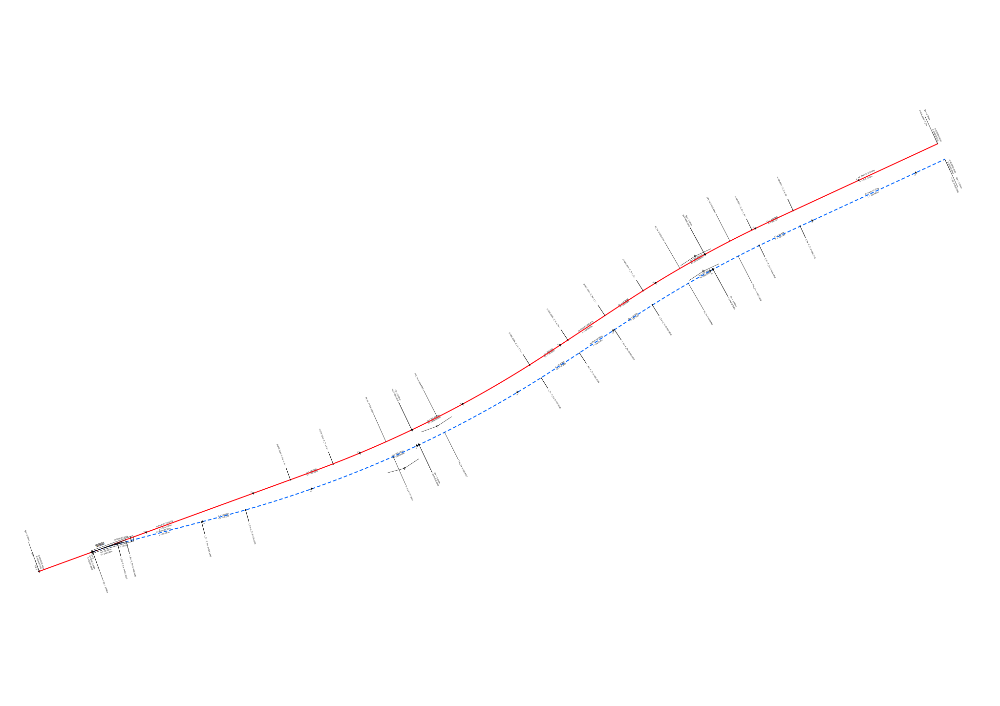
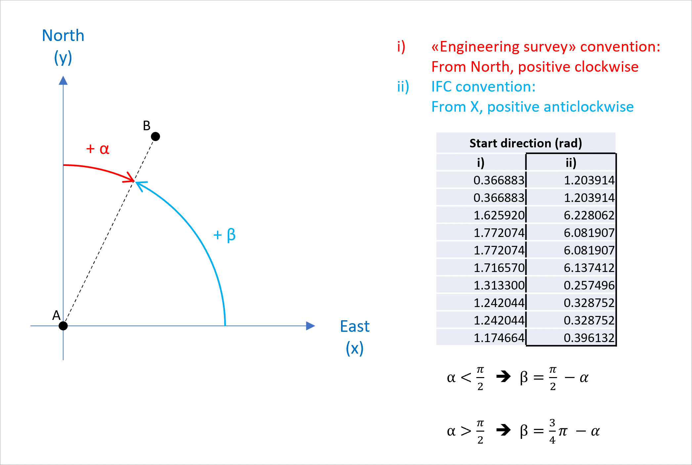

(test dataset template)
# Test dataset

| Test code | Test author     | Test dataset source | Test direction |
|-----------|-----------------|---------------------|----------------|
| AL22      | Evandro Alfieri | RFI                 | Export         |

## Overview

| Info                         |                                           |
|------------------------------|-------------------------------------------|
| Number of alignment(s)       | 2                                         |
| Vertical Measurement         | Lower Rail                                |
| Properties of segments       | no                                        |
| Horizontal layout            | Straight Line, Circular Arc, Clothoid     |
| Vertical layout              | Straight Line, Circular Arc               |
| Cant layout                  | not present                               |
| IFC reference file available | no                                        |

## Model Dataset

This test case utilises the following dataset.

| Filename                                             | Description                                                                                                         |
|------------------------------------------------------|---------------------------------------------------------------------------------------------------------------------|
| [LineLayout](./LineLayout.svg)                       | Schematic [line layout](#Line-layout) of the test case                                                              |
| [Alignment1_horizontal](./Alignment1_horizontal.csv) | [Alignment parameters for horizontal segments](#Alignment-parameters-for-horizontal-segments) of the Primary Route  |
| [Alignment2_horizontal](./Alignment2_horizontal.csv) | [Alignment parameters for horizontal segments](#Alignment-parameters-for-horizontal-segments) of the Diverted Route |
| [Alignment1_vertical](./Alignment1_vertical.csv)     | [Alignment parameters for vertical segments](#Alignment-parameters-for-vertical-segments) of the Primary Route      |
| [Alignment2_vertical](./Alignment2_vertical.csv)     | [Alignment parameters for vertical segments](#Alignment-parameters-for-vertical-segments) of the Diverted Route     |

## Line layout

The line for the test is made of two alignments (*IfcAlignment*):
1. Alignment 1_Primary route (red in the figure below)
2. Alignment 2_Diverted route (blue dashed in the figure below)

Snippet:

The **Primary route** (*IfcAlignment* named *Alignment 1_Primary route*) is made of the following **9 horizontal segments**:

NOTE: units in the table below are in meters (m)

| # | Type of segment | From (pk) | To (pk)  | Segment length |
|---|-----------------|-----------|----------|----------------|
| 1 | LINE            | 0.0000    | 234.7194 | 234.7194       |
| 2 | CLOTHOID        | 234.7194  | 274.7194 | 40.0000        |
| 3 | CIRCULARARC     | 274.7194  | 468.1839 | 193.4645       |
| 4 | CLOTHOID        | 468.1839  | 508.1839 | 40.0000        |
| 5 | LINE            | 508.1839  | 547.1654 | 38.9815        |
| 6 | CLOTHOID        | 547.1654  | 587.1654 | 40.0000        |
| 7 | CIRCULARARC     | 587.1654  | 696.5971 | 109.4317       |
| 8 | CLOTHOID        | 696.5971  | 736.5971 | 40.0000        |
| 9 | LINE            | 736.5971  | 876.3682 | 139.7711       |

The **Diverted route** (*IfcAlignment* named *Alignment 2_Diverted route*) is made of the following **11 horizontal segments**:

NOTE: units in the table below are in meters (m)

| #  | Type of segment | From (pk) | To (pk)  | Segment length |
|----|-----------------|-----------|----------|----------------|
| 1  | CIRCULARARC     | 0.0000    | 22.9021  | 22.9021        |
| 2  | LINE            | 22.9021   | 30.8376  | 7.9355         |
| 3  | LINE            | 30.8376   | 99.1345  | 68.2969        |
| 4  | CLOTHOID        | 99.1345   | 139.1345 | 40.0000        |
| 5  | CIRCULARARC     | 139.1345  | 424.3769 | 285.2424       |
| 6  | CLOTHOID        | 424.3769  | 464.3769 | 40.0000        |
| 7  | LINE            | 464.3769  | 501.2857 | 36.9088        |
| 8  | CLOTHOID        | 501.2857  | 540.9846 | 39.6989        |
| 9  | CIRCULARARC     | 540.9846  | 648.4760 | 107.4914       |
| 10 | CLOTHOID        | 648.4760  | 688.1749 | 39.6989        |
| 11 | LINE            | 688.1749  | 828.0965 | 139.9216       |

All parameters of the segments, for both alignments, are detailed below in:

- [Alignment parameters for horizontal segments](#Alignment-parameters-for-horizontal-segments)
- [Alignment parameters for vertical segments](#Alignment-parameters-for-vertical-segments)

## Alignment parameters for horizontal segments

The horizontal layout of the alignment (both for Alignment 1 and Alignment 2) is described using a CSV file. The column headers match the IFC attributes for `IfcAlignmentHorizontalSegment`. Refers to the standard's documentation for their description.

#### Alignment 1_Primary route

| Entity                        | PredefinedType | Name | Start Point X | Start Point Y | Start Direction | Start Radius Of Curvature | End Radius Of Curvature | Segment Length | Gravity Center Line Height |
|-------------------------------|----------------|------|---------------|---------------|-----------------|---------------------------|-------------------------|----------------|----------------------------|
| IfcAlignmentHorizontalSegment | LINE           | H1   | 452413.9199   | 4539456.401   | 0.349924146     | 0                         | 0                       | 234.719412     |                            |
| IfcAlignmentHorizontalSegment | CLOTHOID       | H2   | 452634.415    | 4539536.869   | 0.349924146     | 0                         | -1000                   | 40             |                            |
| IfcAlignmentHorizontalSegment | CIRCULARARC    | H3   | 452671.898    | 4539550.832   | 0.369924153     | -1000                     | -1000                   | 193.464471     |                            |
| IfcAlignmentHorizontalSegment | CLOTHOID       | H4   | 452844.4075   | 4539637.737   | 0.563388612     | -1000                     | 0                       | 40             |                            |
| IfcAlignmentHorizontalSegment | LINE           | H5   | 452877.9371   | 4539659.548   | 0.583388619     | 0                         | 0                       | 38.981516      |                            |
| IfcAlignmentHorizontalSegment | CLOTHOID       | H6   | 452910.4711   | 4539681.021   | 0.583388619     | 0                         | 1000                    | 40             |                            |
| IfcAlignmentHorizontalSegment | CIRCULARARC    | H7   | 452944.0007   | 4539702.831   | 0.563388612     | 1000                      | 1000                    | 109.43175      |                            |
| IfcAlignmentHorizontalSegment | CLOTHOID       | H8   | 453039.5298   | 4539756.1     | 0.453956871     | 1000                      | 0                       | 40             |                            |
| IfcAlignmentHorizontalSegment | LINE           | H9   | 453075.7086   | 4539773.16    | 0.433956864     | 0                         | 0                       | 139.771059     |                            |

#### Alignment 2_Diverted route

| Entity                        | PredefinedType | Name | Start Point X | Start Point Y | Start Direction | Start Radius Of Curvature | End Radius Of Curvature | Segment Length | Gravity Center Line Height |
|-------------------------------|----------------|------|---------------|---------------|-----------------|---------------------------|-------------------------|----------------|----------------------------|
| IfcAlignmentHorizontalSegment | CIRCULARARC    | H1   | 452460.8898   | 4539473.543   | 0.198563718     | 249.538                   | 249.538                 | 22.902068      |                            |
| IfcAlignmentHorizontalSegment | LINE           | H2   | 452482.7338   | 4539480.396   | 0.096588301     | 0                         | 0                       | 7.9355         |                            |
| IfcAlignmentHorizontalSegment | LINE           | H3   | 452490.4064   | 4539482.422   | 0.096588301     | 0                         | 0                       | 68.296941      |                            |
| IfcAlignmentHorizontalSegment | CLOTHOID       | H4   | 452556.4403   | 4539499.858   | 0.096588301     | 0                         | -1000                   | 40             |                            |
| IfcAlignmentHorizontalSegment | CIRCULARARC    | H5   | 452595.0453   | 4539510.327   | 0.118810514     | -1000                     | -1000                   | 285.242348     |                            |
| IfcAlignmentHorizontalSegment | CLOTHOID       | H6   | 452854.5258   | 4539626.442   | 0.435746458     | -1000                     | 0                       | 40             |                            |
| IfcAlignmentHorizontalSegment | LINE           | H7   | 452888.0554   | 4539648.253   | 0.457968688     | 0                         | 0                       | 36.908858      |                            |
| IfcAlignmentHorizontalSegment | CLOTHOID       | H8   | 452918.8596   | 4539668.585   | 0.457968688     | 0                         | 985                     | 39.698871      |                            |
| IfcAlignmentHorizontalSegment | CIRCULARARC    | H9   | 452952.1378   | 4539690.23    | 0.435577894     | 985                       | 985                     | 107.491403     |                            |
| IfcAlignmentHorizontalSegment | CLOTHOID       | H10  | 453045.9733   | 4539742.554   | 0.314324199     | 985                       | 0                       | 39.698871      |                            |
| IfcAlignmentHorizontalSegment | LINE           | H11  | 453081.8789   | 4539759.487   | 0.291933405     | 0                         | 0                       | 139.921625     |                            |

**NOTE**:
- All distances are in meters
- All angles are in radian (see note below)
- All the coordinates are defined using the UTM Coordinate System (EPSG:3065)
- The *Radius Of Curvature* is considered positive when the curve is to the right, and negative when it is to the left

**IMPORTANT**:

When using IFC to exchange information, the file must respect IFC convention [marked as ii) in the figure below].
This implies a right-hand cartesian coordinate systems; and angles are measured from x-axis, counter clock-wise.

    

## Alignment parameters for vertical segments

The vertical layout of the alignment (both for Alignment 1 and Alignment 2) is described using a CSV file. The column headers match the IFC attributes for `IfcAlignmentVerticalSegment`. Refers to the standard's documentation for their description.

#### Alignment 1_Primary route

| Entity                      | PredefinedType   | Name | Start Dist Along | Horizontal Length | Start Height | Start Gradient | End Gradient | RadiusOfCurvature |
|-----------------------------|------------------|------|------------------|-------------------|--------------|----------------|--------------|-------------------|
| IfcAlignmentVerticalSegment | CONSTANTGRADIENT | V1   | 0                | 0                 | 5            | 0              | 0            |                   |
| IfcAlignmentVerticalSegment | CIRCULARARC      | V2   | 325.0006         | 49.9975           | 5            | 0              | -0.01        | 5000              |
| IfcAlignmentVerticalSegment | CONSTANTGRADIENT | V3   | 374.9981         | 250.0038          | 4.75         | -0.01          | -0.01        |                   |
| IfcAlignmentVerticalSegment | CIRCULARARC      | V4   | 625.0019         | 49.9975           | 2.25         | -0.01          | 0            | -5000             |
| IfcAlignmentVerticalSegment | CONSTANTGRADIENT | V5   | 674.9994         | 201.3688          | 2            | 0              | 0            |                   |

#### Alignment 2_Diverted route

| Entity                      | PredefinedType   | Name | Start Dist Along | Horizontal Length | Start Height | Start Gradient | End Gradient | RadiusOfCurvature |
|-----------------------------|------------------|------|------------------|-------------------|--------------|----------------|--------------|-------------------|
| IfcAlignmentVerticalSegment | CONSTANTGRADIENT | V1   | 0                | 0                 | 5            | 0              | 0            |                   |
| IfcAlignmentVerticalSegment | CIRCULARARC      | V2   | 277.0671         | 49.8646           | 5            | 0              | -0.009973    | 5000              |
| IfcAlignmentVerticalSegment | CONSTANTGRADIENT | V3   | 326.9317         | 250.9366          | 4.7513       | -0.009973      | -0.009973    |                   |
| IfcAlignmentVerticalSegment | CIRCULARARC      | V4   | 577.8683         | 49.8646           | 2.2487       | -0.009973      | 0            | -5000             |
| IfcAlignmentVerticalSegment | CONSTANTGRADIENT | V5   | 627.7329         | 200.3636          | 2            | 0              | 0            |                   |

**NOTE**:
- All distances are in meters
- All angles are in gradian
- The radius (*RadiusOfCurvature*) is considered positive when the curve is a *crest*, and negative when it is a *sag* (opposite to IFC).