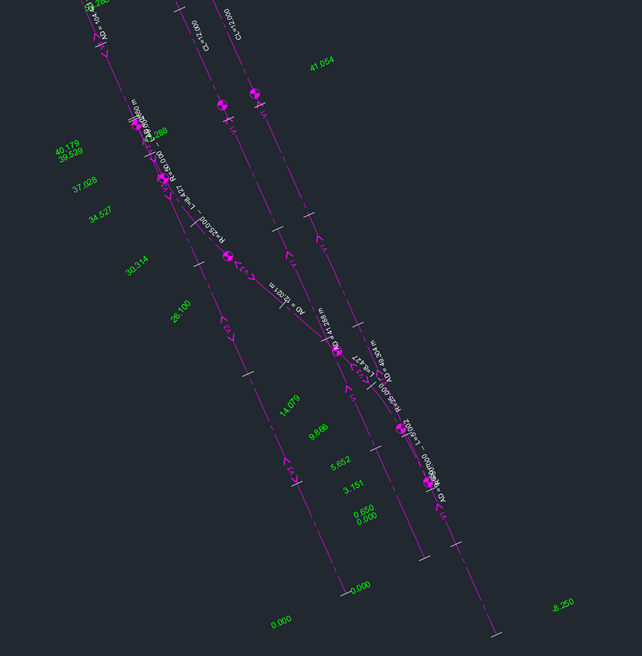

# Test dataset

| Test code | Test author     | Test dataset source | Test direction |
|-----------|-----------------|---------------------|----------------|
| AL01      | Joao Correa     | MINnD               | Import/Export  |

## Content
- [Test dataset](#test-dataset)
  - [Content](#content)
  - [Model Dataset](#model-dataset)
  - [Test Data (Input)](#test-data-input)

## Model Dataset

This dataset is an example of what the Railway Alignment model could contain. This test will test the creation of alignment geometry and its visualization. The alignments created in this Test will be used as the linear positioning based for subsequent Tests. As the shared data required by all the subsequent tests.

### Main IFC concepts involved in this test

The concept templates that are focused by this series of tests are listed as follows. Specific concept templates that are focused by this test are in bold.
- Project Global Positioning
- Alignment Layout
- Alignment Geometry
- Product Local Placement
- Revision Control
- Software Identity
- Object Nesting

### Main software features involved in this series of tests
	
- Alignment visualization

## Test dataset (input)

The dataset is made of a LandXML file that has multiple alignments for a section of a tramway line. The coordinates system is based on RGF93 Lambert Zone 3 ([EPSG:3944](https://epsg.io/3944)) and vertical datum based on the NGF IGN69 ([EPSG:5720](https://epsg.io/5720)).
 It has in total 4 alignments and the railway section is about 1.7 kilometers long. An IFC 4.3 reference file is also provided.

| Filename (format) | Description  |
|-----------------------------|-----------------------------------------------------------------------------------------|
|  BC003_AL01_alignments.xml  |  Data containing track alignments in LandXML format  |
|  BC003_AL01_alignments.dwg  |  Data containing track alignments in DWG format  |
|  BC003_AL01_reference.ifc  | Data containing track alignments in IFC 4.3. Please, note that this IFC file was created using the existing capabilities of Civil 3D, which means that the file is not 100% compliant with the test requirements.  |

## Alignment

The **Alignment** is described through its **horizontal** and **vertical** layouts. They are all described in the LandXML file. In LandXML, each alignment is made as an instance of "Alignment". For example:

https://github.com/bSI-RailwayRoom/IFC4.x-IF/blob/244119caa178226fa9d5ff31dd4774e0aafb1c13/tests/BC003_AL01/Dataset/BC003_AL01_alignments.xml#L10

This defines an alignment object, which has name `SAN1_COM`, a total lenght of `40.179` and start station of `0.000000`. It should be created as an `IfcAlignment` with Name set to `SAN1_COM` and start station (using `IfcReferent`) set to `0`.

### Alignment parameters for horizontal segments

The horizontal profile is described in LandXML using "CoordGeom". Three kinds of segments are used:
- "Curve", which corresponds to `CIRCULARARC` in IFC,
- "Line", which corresponds to `LINE` in IFC, and
- "Spiral", which in this case corresponds to `CLOTHOID` in IFC.
For example:

https://github.com/bSI-RailwayRoom/IFC4.x-IF/blob/244119caa178226fa9d5ff31dd4774e0aafb1c13/tests/BC003_AL01/Dataset/BC003_AL01_alignments.xml#L61-L76

This defines one `LINE` segment, one `CLOTHOID` segment and one `CIRCULARARC` segment with geometric parameters and coordinates.

**IMPORTANT:**
When using IFC to exchange information, the file must respect IFC convention (marked as ii) in the figure below. This implies a right-hand cartesian coordinate system; and angles are measured from x-axis, counter clock-wise.

    

### Alignment parameters for vertical segments

The vertical profile is described in LandXML as "Profile". A fundamental difference with IFC is that vertical layout is described using PVI, which is the point of vertical intersection of the two adjacent grade lines. They must be converted to a segment-based representation in IFC.

https://github.com/bSI-RailwayRoom/IFC4.x-IF/blob/244119caa178226fa9d5ff31dd4774e0aafb1c13/tests/BC003_AL01/Dataset/BC003_AL01_alignments.xml#L189-L191

For example, this section of data defines two adjacent grade lines by three points and parabolic curve between them.

### Stationing

There is no sufficient information about required stationing along alignments in the LandXML file. They are only described in the file [BC003_AL01_alignments.dwg](./Dataset/BC003_AL01_alignments.dwg). In principle, the stationing values are defined as follows:
•	There should be 1 stationing every 10 meters, made as an `IfcReferent.REFERENCEMARKER`.
•	There should be 1 stationing at both start and end point of the alignments, made as an `IfcReferent.STATION`.
•	There should be 1 stationing at each start and end point of the horizontal curves, made as an `IfcReferent.STATION`.

