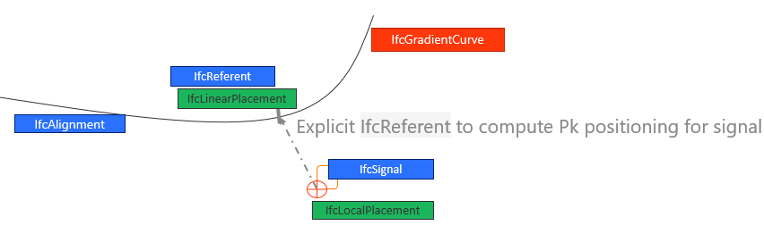
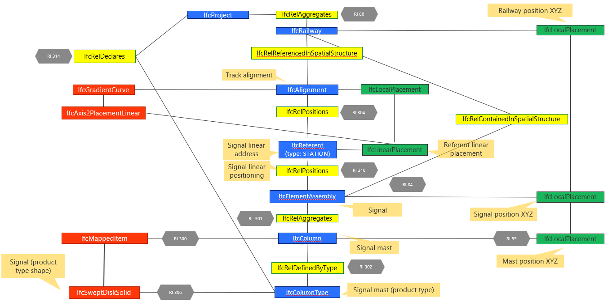

# 4 Stationing tests on equipment - BC003-ALX1

| Test code | Test author     | Test dataset source | Test direction |
|-----------|-----------------|---------------------|----------------|
|BC003-ALX1 | Joao Correa     | MINnD               | Import/Export  |

## Intent

This Test belongs to a series of Tests that share a dataset from the same project as a business case. 
The series of tests that belong to this Business Case are listed as follows:

| Test code | Test name     | 
|-----------|-----------------|
| PS01      | Project setup with georeferencing |
| AL01      | Multiple alignments of railway line |
| RR01      | Railway track elements validation |
| **ALX1**  | **Stationing tests on equipment (punctual)** |
| ALX2      | Stationing tests on nodes (punctual) |
| ALX3      | Alignment reference check on linear elements |
| NE01      | Network integrity/continuity check on linear elements |
| ALX4      | Stationing tests on cable joints (punctual) |
| NE02      | Cable routing |

## IFC concepts involved in this test

The following diagram represents the rationale used for this test: locating signals using XWZ positions and computing their positioning on the alignment.

The following diagram represents the entities involved in this test.

## Prerequisites

The test plan builds upon the previous test plans. All requirements presented in previous test plans must be met.

## Test dataset (input)

This test case utilises the dataset collected in the Dataset folder and is summarised in the table below. **For more details on each item see [Dataset description](Dataset/README.md).**

| Filename (format)                   | Description                                                        |
|-------------------------------------|--------------------------------------------------------------------|
| BC003_ALX1_reference.ifc  | **Reference IFC file.** Contains an exemplary export for this test. Please, note that this IFC file was created using the existing capabilities of Civil 3D, which means that the file is not 100% compliant with the test requirements.|
| BC003_ALX1_equipment.dwg | **Native file.** It’s an Autodesk Civil 3D 2023 file two generic objects that represents railway signals. |

In addition, the outcome of the previous tests shall be used as input of this test.

## Validation criteria

:zap: For this test case to be considered passed, **all criteria listed in this section**, and **the ones of prerequisites tests** shall be verified. :zap:

### Formal rules

#### IFC standard (schema and specification)

When validated using the bSI Validation Service, the IFC must pass:

- Syntax & Schema check
- - [ALB004](https://github.com/buildingSMART/ifc-gherkin-rules/pull/67) Each `IfcAlignment` must be aggregated directly under `IfcProject`.

#### Test case-specific checks

[IDS file BC003_ALX1.ids](./Dataset/BC003_ALX1.ids):

- There `IfcProject` must be named `BC003: Test plan 1` and its GUID must be `“3cyAkba2v5a9pVuthidcpX”`;
- Alignments must have the same Name, GUID and Length as those one found in the `BC003_AL01_Reference` file, which means:

| Name              | GUID                   |  Length (m)  |
|-------------------|------------------------|--------------|
| SAN1_XD-B02       | 0irVCt7iH69Qln9fpXqYVb | 1709.845     |
| SAN1_XG-B02       | 202$CKGz56Q98WGfxCVA5m | 1693.042     |
| SAN1_COM          | 0V9ARKCu5F1O8wEweo6hYa | 40.179       |
| SAN1_XG-3eme_Voie | 06Ng1eKsn2MRkFhhU_YPPI | 104.421      |

- The table below presents the `IfcSignal` Names and GUID:

| Name              | GUID                   |
|-------------------|------------------------|
| Traffic_Light01   | 2$7XSmOBLE88hi1ZsN1xBc |
| Traffic_Light02   | 1M7eCDuXL21QPVVhnAbym8 |

#### Not covered by the IDS file (must be checked otherwise):

1. There must be 2 instances of `IfcSignal`. 
1. Traffic lights are placed in the model using coordinates (XYZ). Once placed, **railway alignment station** is used to **locate** them for works and maintenance purposes. So, the authoring software shall **correlate their XYZ placement and a station in the railway alignment**. The table below represents for each traffic light, its referenced alignment, the referenced station and its placement coordinates of the base center point:

| Name              | Ref. Alignment    |  Station   |  Coord. XYZ (top center point)  |
|-------------------|-------------------|------------|----------------------------------------|
| Traffic_Light01   | SAN1_XD-B02       | 0+052.0866 | 1891995.6561, 3126679.5487, 4.1500 |
| Traffic_Light02   | SAN1_XG-3eme_Voie | 0+052.0002 | 1891982.5663, 3126673.6030, 4.1400 |
3. (RI-90) Each `IfcAlignment` must be aggregated directly under `IfcProject`;
1. (RI-300) Signal geometries are mapped (`IfcMappedItem`) to the `IfcSignalType` geometry;
1. (RI-301) Signals are represented as 3D solids with a cylindrical shape (extruded along the Z axis, using `IfcSweptDiskSolid`);
1. (RI-302) Signals are defined by their `IfcSignalType`, which are declared in the `IfcProject`.

### Informal criteria

- Railway alignments presented in BC003_ALX1_Reference [BC003_ALX1_Reference](./Dataset/BC003_ALX1_Reference.ids) file shall be coincident with the ones presented in  [BC003_AL01_Reference](https://github.com/bSI-RailwayRoom/IFC4.x-IF/blob/3ac4acd3e4e8aeca250a98d59297a125319743a4/tests/BC003_AL01/Dataset/BC003_AL01_Reference.ifc) file ;

### Open questions

- Shall every `IfcElement` instance be accessible through the software Spatial Decomposition Tree?
- `IfcSignal` instances are contained in the SpatialStructure, hence located according to its `IfcLocalPlacement`. This could contradict their own position through the `IfcLinearPlacement`?

### Expected geometry

### Control parameters

The following steps should be performed in order to corroborate that the software is working as expected.

After importing the reference file ([BC003_ALX1_Reference](./Dataset/BC003_ALX1_Reference.ifc)):
- Signals base points shall be the same as presented in the previous table;
- Signals 3D solid shall have `radius=0.05m` and `height=3.50m` ;
- `Traffic_Light01` base point is located at Station `0+052.0866`, distant `2.326m` at the right side of `SAN1_XD-B02` alignment ;
- `Traffic_Light02` base point is located at Station `0+052.0002`, distant `2.006m` at the left side of `SAN1_XG-3eme_Voie` alignment ; 

## Link to requirements

:zap:

