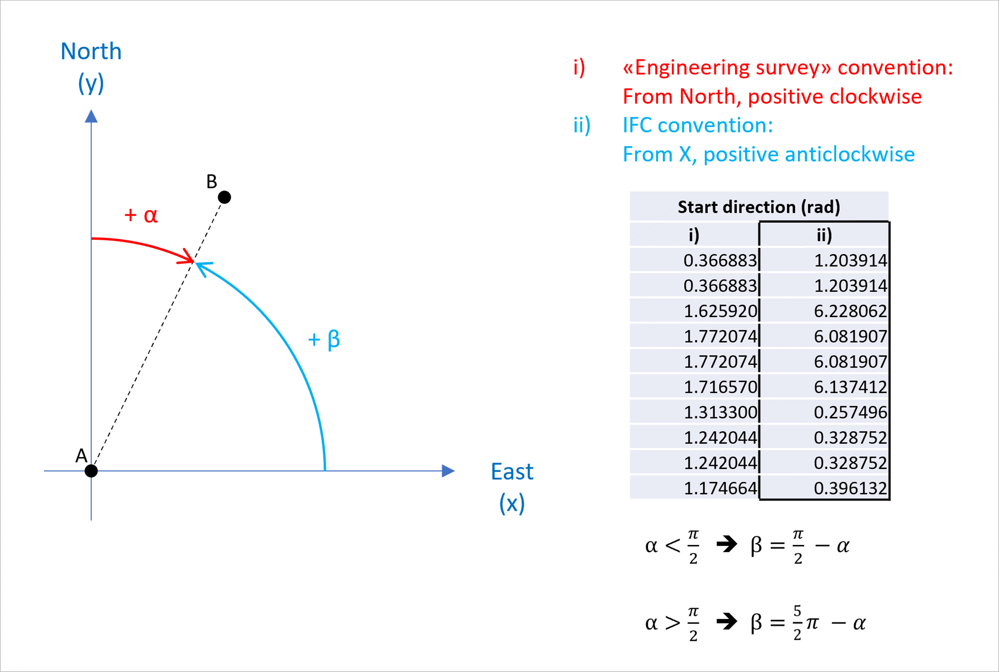

# Test dataset

| Test code | Test author     | Test dataset source | Test direction |
|-----------|-----------------|---------------------|----------------|
| ALX2      | Joao Correa     | MINnD               | Import/Export  |

## Content
- [Test dataset](#test-dataset)
  - [Content](#content)
  - [Model Dataset](#model-dataset)
  - [Test Data (Input)](#test-data-input)

## Model Dataset

This dataset is an example of what the cabling infrastructure nodes model should contain. The objectives of this test are to validate the creation of infrastructure node elements like manholes, cabinets and inspection chambers, their visualization and the creation of the cabling infrastructure alignments that are used to model cable carriers, ducts and cables. The content of this file will be used as reference for subsequent Tests. 

### Main IFC concepts involved in this test

:zap:

## Test dataset (input)

The dataset considers a segment of tramway line. It is made of a dwg file containing inspection chambers, a dwg file containing cabling infrastructure alignments, a LandXML containing the same cabling infrastructure alignments and a IFC reference file.
The coordinates system is based on RGF93 Lambert Zone 3 ([EPSG:3944](https://epsg.io/3944)) and vertical datum based on the NGF IGN69 ([EPSG:5720](https://epsg.io/5720)).
 There are in total **8 inspection chambers** represented by **3D solids** exported as `IfcDistributionChamberElement` with the enumerated type `INSPECTIONCHAMBER`. It also contains 7 cabling infrastructure alignments that will be used as reference for the next tests.

| Filename (format)                   | Description                                                        |
|-------------------------------------|--------------------------------------------------------------------|
| BC003_ALX2_reference.ifc  | **Reference IFC file.** Contains an exemplary export for this test. Please, note that this IFC file was created using the existing capabilities of Civil 3D, which means that the file is not 100% compliant with the test requirements.|
| BC003_ALX2_Inspection_chambers.dwg | **Native file.** It’s an Autodesk Civil 3D 2023 file containing manhole and inspection chamber information. |
| BC003_ALX2_Cabling_alignments.dwg  | **Native file.** It’s an Autodesk Civil 3D 2023 file containing the cabling infrastructure alignments that creates the infrastructure networks connecting the different manholes/junction boxes. |
| BC003_ALX2_Cabling_alignments.xml  | **The exported LandXML format** from the native alignment file containing the same 7 alignments. |

### Inspection chambers

**Inspection chambers** are access points (nodes) to the cabling infrastructure system that allows cable installation and maintenance. They are represented by **3D solids** placed along the model using **georeferenced coordinates (XYZ)** that are then correlated to railway alignments to facilitate their localization in the real world.
Each element has a group of general properties like Global Id, Ifc class, base point, reference alignment and reference station, and a group of technical propertiens including dimensions, material, system or systems that it’s part of and etc.

### Cabling infrastructure alignments
**Cabling infrastructure alignment** connects two network nodes. It’s described through its horizontal, vertical layouts. Its geometry can be completely independent from the railway alignment one. Its horizontal layout is composed by segments of curves, tangents or spirals. In regards to its vertical layout, it’s composed by segments of tangents and parabolic curves.

**IMPORTANT:**
When using IFC to exchange information, the file must respect IFC convention (marked as ii) in the figure below. This implies a right-hand cartesian coordinate system; and angles are measured from x-axis, counter clock-wise.

