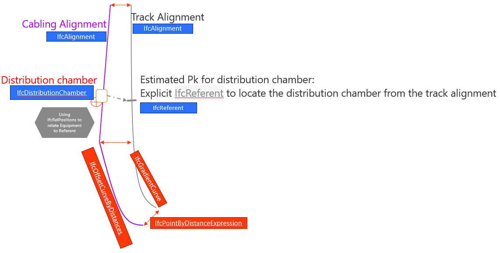

# 5 Stationing tests on nodes - BC003-ALX2

| Test code | Test author     | Test dataset source | Test direction |
|-----------|-----------------|---------------------|----------------|
|BC003-ALX2 | Joao Correa     | MINnD               | Import/Export  |

## Intent

This Test belongs to a series of Tests that share a dataset from the same project as a business case. 
The series of tests that belong to this Business Case are listed as follows:

| Test code | Test name     | 
|-----------|-----------------|
| PS01      | Project setup with georeferencing |
| AL01      | Multiple alignments of railway line |
| RR01      | Railway track elements validation |
| ALX1      | Stationing tests on equipment (punctual)|
| **ALX2**  | **Stationing tests on nodes (punctual)** |
| ALX3      | Alignment reference check on linear elements |
| NE01      | Network integrity/continuity check on linear elements |
| ALX4      | Stationing tests on cable joints (punctual) |
| NE02      | Cable routing |

## IFC concepts involved in this test

The following diagram represents the rationale used for this test.

The following diagram represents the entities involved in this test.

In the test plan ALX02a, the distribution chamber is located using projected coordinate, sharing the Coordinate Reference System with the alignment.

In the test plan ALX02b, the distribution chamber is located using a local Engineering Coordinate System, whereas the alignment uses projcted coordinates.

## Prerequisites

The test plan builds upon the previous test plans. All requirements presented in previous test plans must be met.

## Test dataset (input)

This test case utilises the dataset collected in the Dataset folder and is summarised in the table below. **For more details on each item see [Dataset description](Dataset/README.md).**

| Filename (format)                   | Description                                                        |
|-------------------------------------|--------------------------------------------------------------------|
| BC003_ALX2_reference.ifc  | **Reference IFC file.** Contains an exemplary export for this test. Please, note that this IFC file was created using the existing capabilities of Civil 3D, which means that the file is not 100% compliant with the test requirements.|
| BC003_ALX2_Inspection_chambers.dwg | **Native file.** It’s an Autodesk Civil 3D 2023 file containing manhole and inspection chamber information. |
| BC003_ALX2_Cabling_alignments.dwg  | **Native file.** It’s an Autodesk Civil 3D 2023 file containing the cabling infrastructure alignments that creates the infrastructure networks connecting the different manholes/junction boxes. |
| BC003_ALX2_Cabling_alignments.xml  | **The exported LandXML format** from the native alignment file containing the same 7 alignments. |

In addition, the outcome of the previous tests shall be used as input of this test.

## Validation criteria

:zap: For this test case to be considered passed, **all criteria listed in this section**, and **the ones of prerequisites tests** shall be verified. :zap:

### Formal rules

#### IFC standard (schema and specification)

When validated using the bSI Validation Service, the IFC must pass:

- Syntax & Schema check

#### Test case-specific checks

[IDS file BC003_ALX2.ids](./Dataset/BC003_ALX2.ids):

- There must be 1 instance of `IfcProject` and must be named `BC003: Test plan 1` and the `GUID “3cyAkba2v5a9pVuthidcpX”`;
- Alignments must have the same Name, GUID and Length as those one found in the `BC003_AL01_Reference` file, which means:

| Name              | GUID                   |  Length (m)  |
|-------------------|------------------------|--------------|
| SAN1_XD-B02       | 0irVCt7iH69Qln9fpXqYVb | 1709.845     |
| SAN1_XG-B02       | 202$CKGz56Q98WGfxCVA5m | 1693.042     |
| SAN1_COM          | 0V9ARKCu5F1O8wEweo6hYa | 40.179       |
| SAN1_XG-3eme_Voie | 06Ng1eKsn2MRkFhhU_YPPI | 104.421      |

- Cabling infrastructure alignments must have the Name, GUID and Length according to the table below:

| Name              | GUID                   |  Length (m)  |
|-------------------|------------------------|--------------|
| A1                | 1wibZYcFf8kRCRkcesfjaw | 108.361      |
| A2                | 2jQoh3s8LBnhffD4t9HBEu | 14.567       |
| A3                | 3p6wmnhEXASBW4IPUWbDTO | 47.350       |
| A4                | 2OvvhfzYD7uvBS2xRexDn2 | 14.579       |
| A5                | 0Ju$FFvS1CyRjqJNQKHMqR | 58.982       |
| A6                | 1yQOHkl1z2vujDdCcNmxGq | 39.725       |
| A7                | 2R8oIgNy99GOFlhJEKM7Xv | 9.190        |

- All `IfcDistributionChamberElement` must use the predefined type `INSPECTIONCHAMBER`.

#### Not covered by the IDS file (must be checked otherwise):
- Inspection chambers are placed in the model using coordinates (XYZ). Once placed, **railway alignment station** is used to **locate** then for works and maintenance purposes. So, Inspection Chambers shall **correlate their XYZ placement and a station in the railway alignment**. In some cases, there isn’t a railway alignment near the inspection chamber, so the cabling infrastructure alignment shall be used as reference. The table below presents for each inspection chamber, its referenced alignment, the referenced station and its placement coordinates of the top center point:

| Name              | Ref. Alignment    |  Station   |  Coord. XYZ (top center point)  |
|-------------------|-------------------|------------|----------------------------------------|
| SAN1-PK51_D       | SAN1_XD-B02       | 0+050.7753 | 1891996.6654, 3126678.5628, 4.1500 |
| SAN1-PK51_G       | SAN1_XG-3eme_Voie | 0+050.7864 | 1891982.5212, 3126672.2562, 4.1400 |
| SAN1-PK100_D      | SAN1_XD-B02       | 0+099.7815 | 1891976.7309, 3126723.3403, 3.8402 |
| SAN1-PK100_G      | SAN1_XG-3eme_Voie | 0+099.7848 | 1891962.8352, 3126717.1252, 3.7887 |
| SAN1-PK196_D      | SAN1_XD-B02       | 0+196.2514 | 1892026.6909, 3126789.2905, 3.6375 |
| SAN1-PK196_G      | SAN1_XG-B02       | 0+202.7216 | 1892030.7657, 3126780.1744, 3.6100 |
| SAN1-PK155_G      | SAN1_XG-B02       | 0+161.1289 | 1891988.8846, 3126771.9465, 3.3900 |
| SAN1-PK-60_G      | A1 | CHAMBRE-L5T  | 0+000      | 1892028.8320, 3126572.5160, 4.0000 |

- There must be 8 instances of `IfcDistributionChamberElement`. The table below presents their Name, Description, GUID and dimensions:

| Name              | GUID                   |  Description  |  Dimensions (m)  |
|-------------------|------------------------|---------------|------------------|
| SAN1-PK51_D       | 3bS5p7pIjCSf7OHwcvGgFQ | CHAMBRE-L5T   | 1.18x2.09x1.35   |
| SAN1-PK51_G       | 1GV1OuGwH7rAzQwKk1FNg5 | CHAMBRE-L5T   | 1.18x2.09x1.35   |
| SAN1-PK100_D      | 3XKJ_0LOX7weceRTA7meQZ | CHAMBRE-L5T   | 1.18x2.09x1.35   |
| SAN1-PK100_G      | 3$3Sls09P4iA1o5rF_UObb | CHAMBRE-L2T   | 0.63x1.41x1.28   |
| SAN1-PK196_D      | 1ReXkBNeT5awrIRzMX8ZlJ | CHAMBRE-L2T   | 0.63x1.41x0.98   |
| SAN1-PK196_G      | 3boZFKETn0JuwT4QmVlZFK | CHAMBRE-M1C   | 1.45x2.27x1.44   |
| SAN1-PK155_G      | 1HYAamIkL25wQT3bwOCcoI | CHAMBRE-M1C   | 1.45x2.27x1.44   |
| SAN1-PK-60_G      | 3d9251NuH44xk8yX6C83Nv | CHAMBRE-L5T   | 1.18x2.09x1.35   |

- (RI-7) Stationing value must be stored in the `Pset_Stationing` property set related to the `IfcReferent`.
- (RI-20) Equipment positioning using a `IfcReferent`.
- (RI-61) The chambers geometry must be extruded from a rectangular 2D profile.
- (RI-89) Each `IfcReferent` must link a `Pset_LinearReferencingMethod` property set with its `LRMType` set to `LRM_ABSOLUTE` and its `LRMName` set to `kilometre-point`.

### Informal criteria

- Railway alignments presented in BC003_ALX2_Reference [BC003_ALX2_Reference](./Dataset/BC003_ALX2_Reference.ids) file shall be coincident with the ones presented in  [BC003_AL01_Reference](https://github.com/bSI-RailwayRoom/IFC4.x-IF/blob/3ac4acd3e4e8aeca250a98d59297a125319743a4/tests/BC003_AL01/Dataset/BC003_AL01_Reference.ifc) file ;
- Alignments A1 to A7 have both start and end station inside inspection chamber objects;
- Inspection chambers are represented as 3D solids with parallelepiped shape (extruded from a rectangular 2D profile); 

### Expected geometry

### Control parameters

The following steps should be performed in order to corroborate that the software is working as expected.

After importing the reference file ([BC003_ALX2_Reference](./Dataset/BC003_ALX2_Reference.ifc)):
- Inspection chambers top center points coordinates shall be the same as presented in the previous table;
- The internal distance between chambers `SAN1-PK51_G` and `SAN1-PK51_D` is `14.31m`;

- The internal distance between chambers `SAN1-PK155_G` and `SAN1-PK196_G` is `39.33m`;

## Link to requirements

|ID (local)	| Name | Description | Requirements for Appointed Party |
|-|-|-|-| 
| RI 86 | Unique containment | "Each IfcElement shall be either: - contained in one and only one IfcSpatialStructureElement, or - contained in one and only one IfcLinearPositioningElement." | RA-75 |
|RI 304 | Stationing address | IfcReferents (typed POSITION or STATION) linked to IfcAlignments need a IfcRelPositions relationship | A Linear address shall be known from the alignment it relates to |
|RI 312 | Offset alignment placement | An IfcAlignment which geometry is a IfcOffsetCurveByDistances shall use the same IfcLocalPlacement as the IfcAlignment is relates to | NIL |
| RI 316 | ElementAssemblies stationing | IfcElementAssembly.SIGNAL shall be linked to IFcReferent.STATION by a IfcRelPositions relationship | A signal assembly should have its stationing defined |
|RI 317 | Local Engineering Coordinates | It shall be possible to have many IfcGeometricRepresentationContext entities with CoordinateDimension=3 that reference different IFcCoordinateOperation entities. See [open issue 317](https://github.com/buildingSMART/IFC4.3.x-development/issues/317)  which conflicts with  [IfcGeometricRepresentationContext](https://ifc43-docs.standards.buildingsmart.org/IFC/RELEASE/IFC4x3/HTML/lexical/IfcGeometricRepresentationContext.htm) and [GRF001](https://github.com/buildingSMART/ifc-gherkin-rules/blob/main/features/GRF001_Identical-coordinate-operations.feature) | Some railway facility should be positioned wrt an alignment but have its geometry placement defined in local engineering coordinates |
