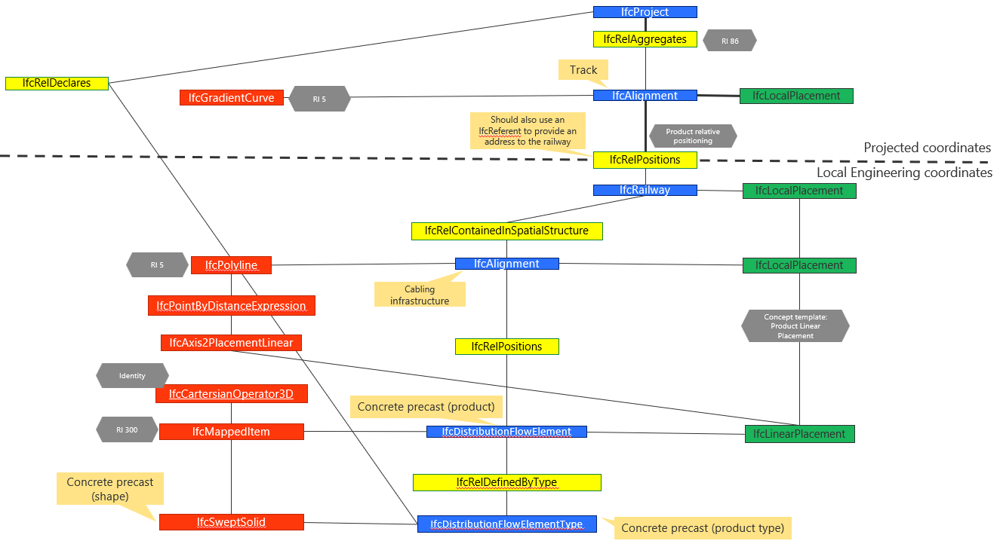

# 5 Stationing tests on nodes - BC003-ALX3b

| Test code  | Test author     | Test dataset source | Test direction |
|------------|-----------------|---------------------|----------------|
|BC003-ALX3b | Joao Correa     | MINnD               | Import/Export  |

## Intent

This Test belongs to a series of Tests that share a dataset from the same project as a business case. 
The series of tests that belong to this Business Case are listed as follows:

| Test code | Test name     | 
|-----------|-----------------|
| PS01      | Project setup with georeferencing |
| AL01      | Multiple alignments of railway line |
| RR01      | Railway track elements validation |
| ALX1      | Stationing tests on equipment (punctual)|
| ALX2      | Stationing tests on nodes (punctual) |
| ALX3a     | Alignment reference check on linear elements (early design) |
| ALX3b     | **Alignment reference check on linear elements (detailed design, precast)** |
| ALX3c     | Alignment reference check on linear elements (detailed design, case-in-place) |
| NE01      | Network integrity/continuity check on linear elements |
| ALX4      | Stationing tests on cable joints (punctual) |
| NE02      | Cable routing |

## IFC concepts involved in this test

The following test intends to address the use case where the cable infrastructure is made of pre-cast concrete elements, following its own aligment, related to the tracks:

The following diagram represents the rationale used for this test: the cabling supporting structure follows the track alignment but on a separate alignment, represented by a polyline.

The cabling supporting structure is represented by a swept volume using the following 2D profile:

The following diagram represents the entities involved in this test.

## Prerequisites

The test plan builds upon the previous test plans. All requirements presented in previous test plans must be met.

## Test dataset (input)

This test case utilises the dataset collected in the Dataset folder and is summarised in the table below. **For more details on each item see [Dataset description](Dataset/README.md).**

In addition, the outcome of the previous tests shall be used as input of this test.

## Validation criteria

:zap: For this test case to be considered passed, **all criteria listed in this section**, and **the ones of prerequisites tests** shall be verified. :zap:

### Formal rules

#### IFC standard (schema and specification)

When validated using the bSI Validation Service, the IFC must pass:

- Syntax & Schema check

#### Test case-specific checks

:hourglass:

#### Not covered by the IDS file (must be checked otherwise):

:hourglass:

### Informal criteria

- The precast elements are defined in a `DistributionFlowElementType`
- The precast elements geometries are mapped, in order to avoid geometry duplication

Open questions:
- Should we use some `IfcRelNests` relationship between Alignments?
- Some Concept Template seems required in order use `IfcRelPositions` to link the cable carrier to the alignment?
- The cable carrier needs to be spatially contained in the IfcRailway, but is located w.r.t. some alignment. Does it introduce some potential inconstistancy?  

### Control parameters

The following steps should be performed in order to corroborate that the software is working as expected.

:hourglass:

## Link to requirements

:zap:

