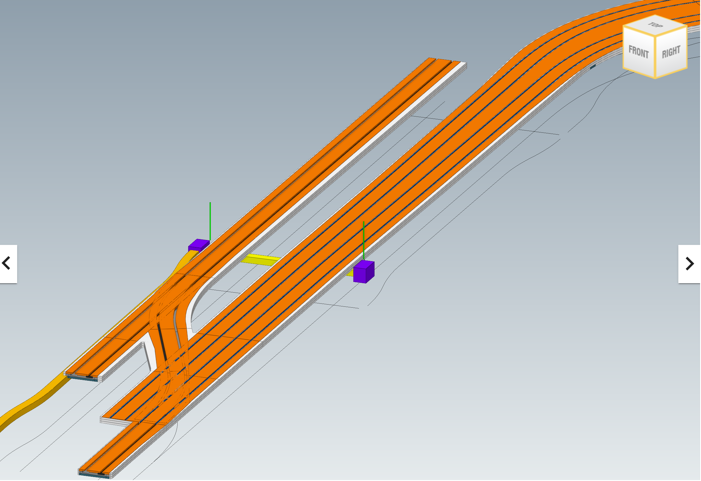
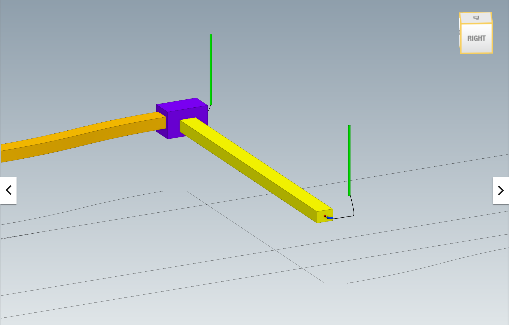
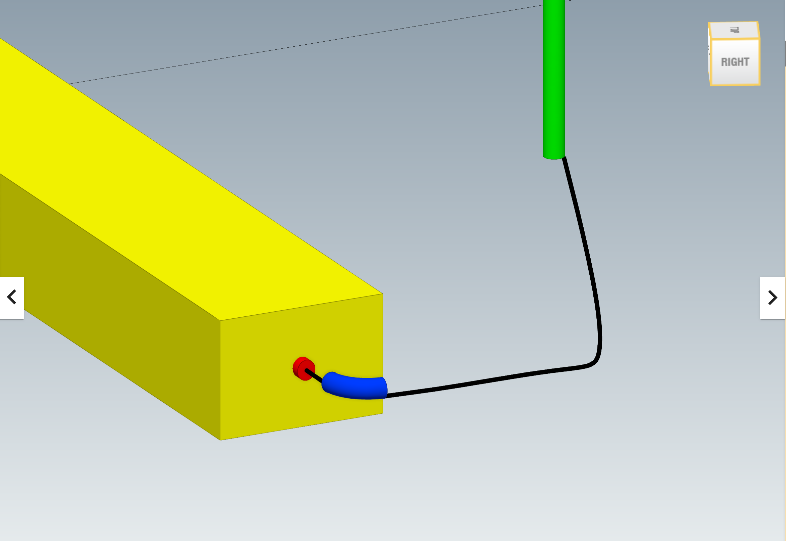

# 8 Stationing tests on cable joints - BC003-ALX4

| Test code | Test author     | Test dataset source | Test direction |
|-----------|-----------------|---------------------|----------------|
|BC003-ALX4 | Joao Correa     | MINnD               | Import/Export  |

## Intent

This Test belongs to a series of Tests that share a dataset from the same project as a business case. 
The series of tests that belong to this Business Case are listed as follows:

| Test code | Test name     | 
|-----------|-----------------|
| PS01      | Project setup with georeferencing |
| AL01      | Multiple alignments of railway line |
| RR01      | Railway track elements validation |
| ALX1      | Stationing tests on equipment (punctual) |
| ALX2      | Stationing tests on nodes (punctual) |
| ALX3      | Alignment reference check on linear elements |
| NE01      | Network integrity/continuity check on linear elements |
| **ALX4**  | **Stationing tests on cable joints (punctual)** |
| NE02      | Cable routing |

## Prerequisites

The test plan builds upon the previous test plans. All requirements presented in previous test plans must be met.

## Test dataset (input)

This test case utilises the dataset collected in the Dataset folder and is summarised in the table below. **For more details on each item see [Dataset description](Dataset/README.md).**

| Filename (format)                   | Description                                                        |
|-------------------------------------|--------------------------------------------------------------------|
| BC003_ALX4_reference.ifc  | **Reference IFC file.** Contains an exemplary export for this test. Please, note that this IFC file was created using the existing capabilities of Civil 3D, which means that the file is not 100% compliant with the test requirements.|
| BC003_ALX4_cable_joints.dwg | **Native file.** It’s an Autodesk Civil 3D 2024 file containing a sample of a classic low voltage/signalisation system network represented as generic 3D objects, including the cable joints that are the main subject of this test. Ports and connections were not modeled due to software limitation, indeed they're expected in the deployment tests |

In addition, the outcome of the previous tests shall be used as input of this test.

## Validation criteria

:zap: For this test case to be considered passed, **all criteria listed in this section**, and **the ones of prerequisites tests** shall be verified. :zap:

### Formal rules

#### IFC standard (schema and specification)

When validated using the bSI Validation Service, the IFC must pass:

- Syntax & Schema check

#### Test case-specific checks

[IDS file BC003_ALX4.ids](./Dataset/BC003_ALX4.ids):

- There must be 1 instance of `IfcProject` and must be named `BC003: Test plan 1` and the `GUID “3cyAkba2v5a9pVuthidcpX”`;
- Alignments must have the same Name, GUID and Length as those ones found in the `BC003_AL01_Reference` and `BC003_AL01_Reference` files, which means:

| Name              | GUID                   |  Length (m)  |
|-------------------|------------------------|--------------|
| SAN1_XD-B02       | 0irVCt7iH69Qln9fpXqYVb | 1709.845     |
| SAN1_XG-B02       | 202$CKGz56Q98WGfxCVA5m | 1693.042     |
| SAN1_COM          | 0V9ARKCu5F1O8wEweo6hYa | 40.179       |
| SAN1_XG-3eme_Voie | 06Ng1eKsn2MRkFhhU_YPPI | 104.421      |
| A1                | 1wibZYcFf8kRCRkcesfjaw | 108.361      |
| A2                | 2jQoh3s8LBnhffD4t9HBEu | 14.567       |
| A3                | 3p6wmnhEXASBW4IPUWbDTO | 47.350       |
| A4                | 2OvvhfzYD7uvBS2xRexDn2 | 14.579       |
| A5                | 0Ju$FFvS1CyRjqJNQKHMqR | 58.982       |
| A6                | 1yQOHkl1z2vujDdCcNmxGq | 39.725       |
| A7                | 2R8oIgNy99GOFlhJEKM7Xv | 9.190        |

**Partially covered by IDS:**

- There must be 2 instances of `IfcSign` as presented in the `BC003_ALX1_Reference` file. The table below presents their Name and GUID:

| Name              | GUID                   |  Station   |  Coord. XYZ (top center point)  |
|-------------------|------------------------|------------|----------------------------------------|
| Traffic_Light01   | 2$7XSmOBLE88hi1ZsN1xBc | 0+052.0866 | 1891995.6561, 3126679.5487, 4.1500 |
| Traffic_Light02   | 1M7eCDuXL21QPVVhnAbym8 | 0+052.0002 | 1891982.5663, 3126673.6030, 4.1400 |

- There must be 3 instances of `IfcDistributionChamberElement` with the predefined type `INSPECTIONCHAMBER`. These instances are part of the `BC003_ALX2_Reference` file. The table below presents their Name, Description, GUID and dimensions:

| Name              | GUID                   |  Station   |  Coord. XYZ (top center point)  |
|-------------------|------------------------|------------|----------------------------------------|
| SAN1-PK51_D       | 3bS5p7pIjCSf7OHwcvGgFQ | 0+050.7753 | 1891996.6654, 3126678.5628, 4.1500 |
| SAN1-PK51_G       | 1GV1OuGwH7rAzQwKk1FNg5 | 0+050.7864 | 1891982.5212, 3126672.2562, 4.1400 |
| SAN1-PK-60_G      | 3d9251NuH44xk8yX6C83Nv | 0+000      | 1892028.8320, 3126572.5160, 4.0000 | 

- There must be 2 instances of `IfcDistributionElement`. The table below presents their Name, GUID, Start Chamber, Start Station and Alignment, End Chamber, End Station and Alignment:
 
| Name    | GUID                   |  Start Chamber  |  Start Station & Alignment     |  End Chamber      | End Station & Alignment       |
|---------|------------------------|-----------------|--------------------------------|-------------------|-------------------------------|
|  MS2.3  | 1XIUzyJh51NPH5Be0PZVDi |  SAN1-PK-60_G   |  0+000.000 (A1)             |  SAN1-PK51_G  | 0+49.874 (SAN1_XG-3eme_Voie)  |
|  Duct  | 1PdCWKKzDD4B81BLMvyRF_  |  SAN1-PK51_G    |  0+50.786 (SAN1_XG-3eme_Voie)  |  SAN1-PK51_D  | 0+50.775 (SAN1_XD-B02)           |

- There must be 1 instances of `IfcCableCarrierSegment` with the predefined type `CONDUITSEGMENT`. The table below presents their Name, GUID, Cable Trough, Start Station and Alignment and End Station and Alignment:

| Name            | GUID                     |  Start Chamber  |  Cable Trough  |  End Chamber |  Start Station & Alignment     | End Station & Alignment       |
|-----------------|--------------------------|-----------------|----------------|-----------------|------------------------------|------------------------|
|  Cable carrier  |  0pyT71tSbDFPHj8T_wvs0k  | SAN1-PK51_G     | Duct           | SAN1-PK51_D  | 0+50.786 (SAN1_XG-3eme_Voie) | 0+50.775 (SAN1_XD-B02) | 

- There must be 4 instances of `IfcCableSegment` with the predefined type `OPTICALCABLESEGMENT`. The table below presents their Name, GUID, Length, Contained by, Start Connection and End Connection:

| Name     | GUID                     | Length  | Contained by  | Start Connection | End Connection |
|---------|--------------------------|---------|---------------|-----------------|------------------|
| Cable1.1 | 1h2af4B7T92frxdCs2IAtn  | 1.867   |               | Traffic_Light02 | Cable_Joint02 |
| Cable1.2 | 13yvrdcNnCM8oMBFkuWdZf  | 1.786   | SAN1-PK51_G   | Cable_Joint02   | Cable carrier |
| Cable1.4 | 2UWLvY3xH1rOM_wC93xylH  | 0.246   | SAN1-PK51_D   | Cable carrier   | Cable_Joint01 |
| Cable1.5 | 05X95Sb2D6nwmDXv1PCyvc  | 2.181   |               | Cable_Joint01   | Traffic_Light01 |

- There must be 2 instances of `IfcCableFitting` with the predefined type `CONNECTOR`. The table below presents their Name, GUID, Contained by, Station and Alignment, In-connection, Out-connection:

| Name          | GUID                     |  Contained by  | Station and Alignment | In-connection | Out-connection |
|---------------|--------------------------|----------------|----------------------------|---------------------|--------------------------|
| Cable_Joint01 | 3D$W7yKET8FgbInqrbQRvs   | SAN1-PK51_D    | 0+050.775 (SAN1_XD-B02)     | Cable1.4   | Cable1.5       | 
| Cable_Joint02 | 0gBdZoD6H94geDFUW$eZwo   | SAN1-PK51_G    | 0+50.786 (SAN1_XG-3eme_Voie) | Cable1.1   | Cable1.2       |

**Not covered by the IDS file (must be checked otherwise):**
- Cable joints are placed inside the chambers using coordinates (XYZ). They're used when the cable lenght exceed its limits or when a technical restriction imposes it. When placed, **railway alignment station** is used to **locate** then for works and maintenance purposes. So, cable joints shall **correlate their XYZ placement and a station in the railway alignment**.
- All necessary **relationships to connect and describe both infrastructure and cabling network** shall be checked otherwise;

### Informal criteria

- Railway alignments presented in BC003_ALX4_Reference [BC003_ALX4_Reference](./Dataset/BC003_ALX4_Reference.ifc) file shall be coincident with the ones presented in  [BC003_AL01_Reference](https://github.com/bSI-RailwayRoom/IFC4.x-IF/blob/3ac4acd3e4e8aeca250a98d59297a125319743a4/tests/BC003_AL01/Dataset/BC003_AL01_Reference.ifc) and [BC003_ALX2_Reference](https://github.com/bSI-RailwayRoom/IFC4.x-IF/blob/2bef1a8aabeb98167ec1ba4589ad7fd0185a4204/tests/BC003_ALX2/Dataset/BC003_ALX2_Reference.ifc) files;
- Cable joints are represented by generic 3D solids. They must be contained by the distribution chambers;
- Cables elements must be connected (in contact) to cable carriers and/or cable joints and/or equipments;
- Chambers shall be connected by cable troughs (distribution flow elements);

### Expected geometry

### Control parameters

The following steps should be performed in order to corroborate that the software is working as expected.

After importing the reference file ([BC003_ALX4_Reference](./Dataset/BC003_ALX4_Reference.ifc)):
- `Cables length` shall be the same as presented in the previous table;
- `Cable_Joint01` is located at station `0+50.775` distant `2.672m` at the right of `SAN1_XD-B02` alignment;
- `Cable_Joint02` center point has the following XYZ coordinates: `1891982.5212`, `3126672.2562`, `3.4650` ;

## Link to requirements

:zap:

