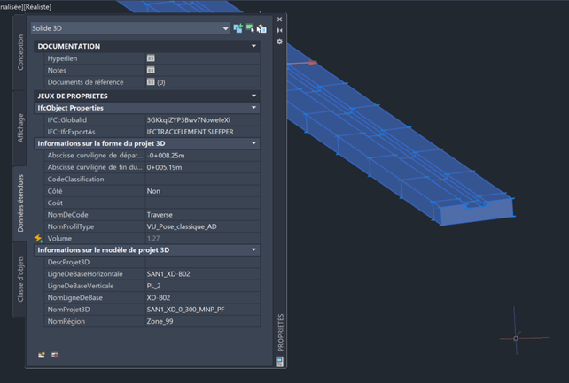

# Test dataset

| Test code | Test author     | Test dataset source | Test direction |
|-----------|-----------------|---------------------|----------------|
| RR01      | Joao Correa     | MINnD               | Import/Export  |

## Content
- [Test dataset](#test-dataset)
  - [Content](#content)
  - [Model Dataset](#model-dataset)
  - [Test Data (Input)](#test-data-input)

## Model Dataset

This dataset is an example of what the Railway track model could contain. This test will test the creation of track elements objects and its visualization. These elements will be used as referencing for modeling the elements in subsequent Tests. 

### Main IFC concepts involved in this test

:zap:

## Test dataset (input)

The dataset is made of a dwg file that has multiple alignments and 3D solids for a section of a tramway line. The coordinates system is based on RGF93 Lambert Zone 3 ([EPSG:3944](https://epsg.io/3944)) and vertical datum based on the NGF IGN69 ([EPSG:5720](https://epsg.io/5720)).
 It has in total 4 alignments and the railway section is about 1.7 kilometers long. The tramway line is represented by 3D solids that shall be exported using three different Ifc classes:
- Rails as `IfcRail` using the enumerated type `RAIL`;
- Sleepers as `IfcTrackElement` using the enumerated type `SLEEPER`;
- All others as `IfcBuiltElement` as a simplification of the test;

An IFC 4.3 reference file is also provided.

| Filename (format)           | Description                                              |
|-----------------------------|-----------------------------------------------------------------------------------------|
|  BC003_RR01.dwg             |  Data containing track alignments and railway track elements in DWG format.  |
|  BC003_RR01_Reference.ifc  |  Data containing track alignments and railway track elements in IFC 4.3. Please, note that this IFC file was created using the existing capabilities of Civil 3D, which means that the file is not 100% compliant with the test requirements.  |
|  [BC003_AL01_alignments.xml](./Dataset/BC003_AL01_alignments.XML)   | This file is part of [BC003_AL01](https://github.com/bSI-RailwayRoom/IFC4.x-IF/tree/3ac4acd3e4e8aeca250a98d59297a125319743a4/tests/BC003_AL01) test dataset. It contains track alignment information in LandXML format and can be used in this test to facilitate the alignments creation.   |

### Alignment

The **Alignment** is described through its **horizontal**, **vertical** layouts. They are all described in the LandXML file. See [BC003_AL01](https://github.com/bSI-RailwayRoom/IFC4.x-IF/tree/3ac4acd3e4e8aeca250a98d59297a125319743a4/tests/BC003_AL01) for more information.

### Railway track Elements
**Railway track elements** are represented by **3D solids** created by the extrusion of a cross-section along the alignment `(swept solid)`. 
Each element has a group of properties presenting their `Global Id`, `fc class`, `start station`, `end station` and both horizontal and vertical `reference alignments` used in their creation.

As a model simplification, in this reference file, only **Rail** and **Sleepers** elements were properly classed using **Ifc 4.3** classes. All other railway track objects were classed as generic `IfcBuiltElements`.

