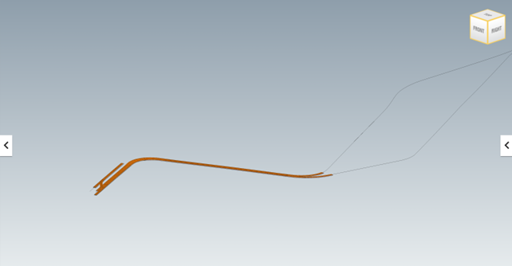
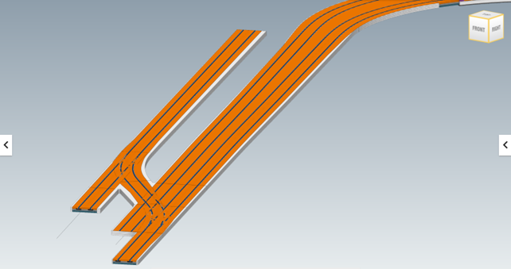
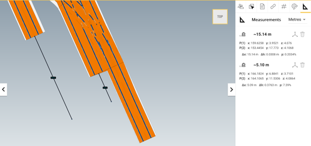

# 3 Railway track elements validation - BC003-RR01

| Test code | Test author     | Test dataset source | Test direction |
|-----------|-----------------|---------------------|----------------|
|BC003-RR01 | Joao Correa     | MINnD               | Import/Export  |

## Intent

This Test belongs to a series of Tests that share a dataset from the same project as a business case. 
The series of tests that belong to this Business Case are listed as follows:

| Test code | Test name     | 
|-----------|-----------------|
| PS01      | Project setup with georeferencing |
| AL01      | Multiple alignments of railway line |
| **RR01**  | **Railway track elements validation** |
| ALX1      | Stationing tests on equipment (punctual)|
| ALX2      | Stationing tests on nodes (punctual) |
| ALX3      | Alignment reference check on linear elements |
| NE01      | Network integrity/continuity check on linear elements |
| ALX4      | Stationing tests on cable joints (punctual) |
| NE02      | Cable routing |

## Prerequisites

The test plan builds upon [PS01](https://github.com/bSI-RailwayRoom/IFC4.x-IF/blob/BC003/tests/BC003_PS01/readme.md) and [AL01](https://github.com/bSI-RailwayRoom/IFC4.x-IF/blob/BC003/tests/BC003_AL01/readme.md) test plans.

## Test dataset (input)

The dataset is composed of a LandXML file that contains alignments for a section of a 1.7 kilometers long tramway line. In this file you’ll find 4 aligments that compose this section.
The coordinates system is based on RGF93 Lambert Zone 3 ([EPSG 3944](https://epsg.io/3944)) and the vertical datum NGF IGN69 ([EPSG:5720](https://epsg.io/5720)).

This test case utilises the dataset collected in the Dataset folder and is summarised in the table below. **For more details on each item see [Dataset description](Dataset/README.md).**

| Filename (format)         | Description                                                        |
|---------------------------|--------------------------------------------------------------------|
| BC003_RR01_reference.ifc  | **Reference IFC file.** Contains an exemplary export for this test. Please, note that this IFC file was created using the existing capabilities of Civil 3D, which means that the file is not 100% compliant with the test requirements.|
| BC003_RR01.dwg            | **Native file.** It’s an Autodesk Civil 3D 2023 file containing the tramway track information including the alignments used in the test plan [AL01](https://github.com/bSI-RailwayRoom/IFC4.x-IF/blob/BC003/tests/BC003_AL01/readme.md) .|

In addition, the outcome of the tests PS01 and AL01 shall be used as input of this test.

## Validation criteria

:zap: For this test case to be considered passed, **all criteria listed in this section**, and **the ones of prerequisites tests** shall be verified. :zap:

### Formal rules

#### IFC standard (schema and specification)

When validated using the bSI Validation Service, the IFC must pass:

- Syntax & Schema check

#### Test case-specific checks

[IDS file BC003_RR01.ids](./Dataset/BC003_RR01.ids):

- There must be 1 instance of `IfcProject` and must be named `BC003: Test plan 1` and the `GUID “3cyAkba2v5a9pVuthidcpX”`;
- Alignments must have the same Name, GUID and Length as those one found in the `BC003_AL01_Reference` file, which means:

| Name              | GUID                   |  Length (m)  |
|-------------------|------------------------|--------------|
| SAN1_XD-B02       | 0irVCt7iH69Qln9fpXqYVb | 1709.845     |
| SAN1_XG-B02       | 202$CKGz56Q98WGfxCVA5m | 1693.042     |
| SAN1_COM          | 0V9ARKCu5F1O8wEweo6hYa | 40.179       |
| SAN1_XG-3eme_Voie | 06Ng1eKsn2MRkFhhU_YPPI | 104.421      |

Not covered by the IDS file but information can be extracted from it for external analysis:
- There must be a total of:
	- 389 objects classed as `IfcBuiltElement`;
	- 50 objects classed as `IfcRail` elements;
	- And 50 objects classed as `IfcTrackElement`;

Not covered by the IDS file (must be checked otherwise):
- The modeled objects (`IfcBuiltElement`, `IfcRail`, `IfcTrackElement`) shall be contained by the `IfcAlignment` used to reference them; 

### Informal criteria

- Alignments presented in BC003_RR01_Reference [BC003_RR01_Reference](./Dataset/BC003_RR01_Reference.ids) file shall be coincident with the ones presented in  [BC003_AL01_Reference](https://github.com/bSI-RailwayRoom/IFC4.x-IF/blob/3ac4acd3e4e8aeca250a98d59297a125319743a4/tests/BC003_AL01/Dataset/BC003_AL01_Reference.ifc) file ; 

### Expected geometry

### Control parameters

The following steps should be performed in order to corroborate that the software is working as expected.

After importing the reference file ([BC003_RR01_Reference](./Dataset/BC003_RR01_Reference.ids)):
- The tramway track model starts at the following stations:
	- `SAN1_XD-B02`: 0-008.250 (`0m` from alignment’s start station)
	- `SAN1_XG-B02`: 0+005.100 (`5.100m` from alignment’s start station)
	- `SAN1_XG-3eme_Voie`: 0+015.140 (`15.140m` from alignment’s start station)

## Link to requirements

:zap:

