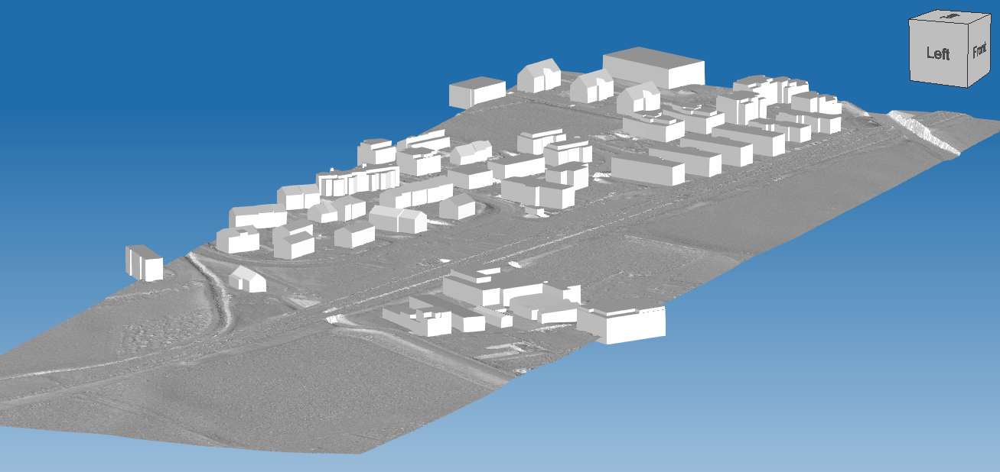

# Test dataset

| Test code | Test author     | Test dataset source | Test direction |
|-----------|-----------------|---------------------|----------------|
| BU01      | Stefan Jaud     | SBB                 | Export         |

## Model Dataset

This dataset is an example of what a terrain model with the surrounding buildings could look like.

Additionally to the content of [TE01](../../TE01/Dataset/readme.md),
 there are 47 `IfcBuilding`s.

Each has a property set named `'SBB-CFF-FFS'` attached with these properties:
1. named `'Status'` with value `'Bestand'`,
1. named `'ObjectTypeName'` with value `'Gebäude (CD)'` and
1. named `'ObjectTypeID'` with value `'tbd'`.

