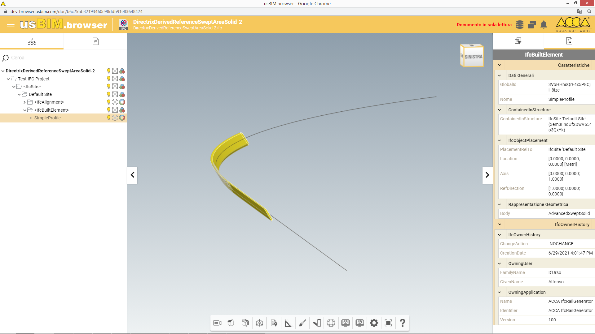

# DirectrixDerivedReferenceSweptAreaSolid-2

| Test code | Test author             | Test dataset source | Test direction |
|-----------|-------------------------|---------------------|----------------|
| DDRSASH02 | Michelangelo Cianciulli | ACCA                | Export         |

## Intent
This scenario allows testing of a fixed reference swept area solid using IfcDirectrixDerivedReferenceSweptAreaSolid with a rotated profile.

Main IFC concept templates involved in this test
 

- Project Global Positioning
- Alignment Layout
- Spatial Decomposition
- Spatial Containment
- Alignment Geometry
- Alignment Geometry Gradient
- Product Geometric Representation
- Body SectionedSolidHorizontal

## Prerequisites
None

## Test dataset (input)
This test case utilises the dataset collected in the Dataset folder and summarised in the table below.

| Filename(format)                   | Description                                                                                                                                                                                                               |
|------------------------------------|---------------------------------------------------------------------------------------------------------------------------------------------------------------------------------------------------------------------------|
| DirectrixDerivedReferenceSweptAreaSolid-2.ifc | **Reference IFC file**. Contains the definition of a simple profile and the use of IfcDirectrixDerivedReferenceSweptAreaSolid to sweep a rotated profile along the gradient curve of the defined alignment |
| DirectrixDerivedReferenceSweptAreaSolid-2.png     | Screenshot of the IFC model                                                                                                                                                                                               |

## Validation criteria
:zap: For this test case to be considered passed, **all criteria listed in this section**, and **the ones of prerequisites tests** shall be verified. :zap:

### Formal rules
n.a.

### Informal criteria
n.a

### Expected geometry

### Control parameters
n.a.