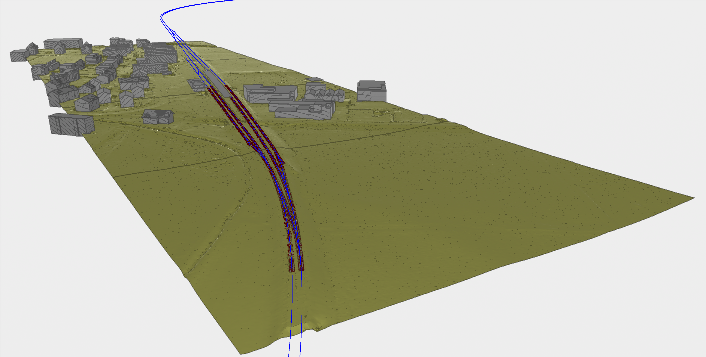

# Test dataset

| Test code | Test author     | Test dataset source | Test direction |
|-----------|-----------------|---------------------|----------------|
| MF01     | Chi Zhang   | SBB                 | Import, Export         |

## Content
- [Test dataset](#test-dataset)
  - [Content](#content)
  - [Overview](#overview)
  

## Overview

This Test shall take the datasets from [PS01](tests/PS01), [TE01](tests/TE01), [BU01](tests/BU01), [AL01](tests/AL01), [TR01](tests/TR01) and [BU02](tests/BU02). There is no additional datasets for this Test.

