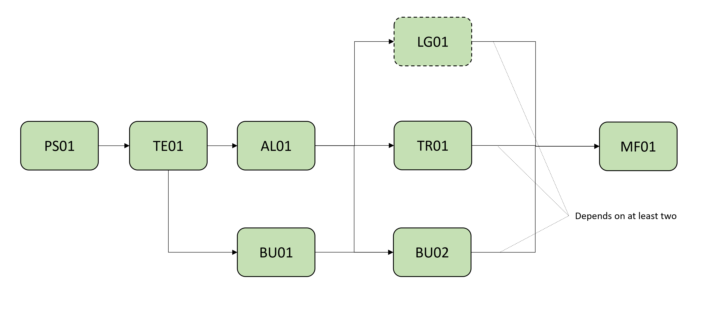

# MF01 - Model Federation

| Test code | Test author     | Test dataset source | Test direction |
|-----------|-----------------|---------------------|----------------|
| MF01      | Chi Zhang       | SBB                 | Export, Import |

## Intent

This Test belongs to a series of Tests that share a dataset from the same project as a business case. 
The intention of this Business Case is to test how model federation works in the context of IFC 4.3. 
In particular we want to test the behaviour of objects that are located in relation to an alignemnt (for example a turnout within an alignment) and in relation to fixed coordinates (for example existing buildings) with georeferencing information set as the global context.
We would also like to test other essential concepts that are related to model federation like project break down structure (or to say, Spatial Structure) and revision and access control for elements.
The series of tests that belong to this Business Cases are listed as follows:

| Test code | Test name     | 
|-----------|-----------------|
| PS01      | Project setup with georeferencing |
| TE01      | Terrain as existing condition model|
| AL01  | Multiple alignments of railway line |
| LG01      | Loading gauge|
| TR01      | Track panels positioned along alignments |
| BD01      | Building and terrain as existing condition model |
| BD02      | Building positioned along alignment |
| **MF01**      | **Model federation** |

With this series of tests, we are attempting to build a step-by-step process to realize a business case.
The dependency between them are shown in the following diagram:

To perform a certain test in this series, developers can start from the very beginning (AKA. PS01) to build all the prerequisites independently, or based on outcomes or reference files from prerequisites tests.

This particular Test is the final step of this series. It aims to test the model federtion that integrates multiple models from different domains. It is at least based on the TR01, which defines model of track panels, and BU02, which contains buildings. This Test will test a few topics:
- whether the federated model has the proper spatial structure
- whether certain elements from different models are merged based on GlobalID
- whether models can be coordinated correctly based on the project context and georeferencing
- and etc.

	
Main IFC concepts involved in this test
 

The concept templates that are focused by this Test are listed as follows. 

- [Project Global Positioning](https://ifc43-docs.standards.buildingsmart.org/IFC/RELEASE/IFC4x3/HTML/concepts/Project_Context/Project_Global_Positioning/content.html)
- [Product Local Placement](https://ifc43-docs.standards.buildingsmart.org/IFC/RELEASE/IFC4x3/HTML/concepts/Product_Shape/Product_Placement/Product_Local_Placement/content.html)
- [Product Linear Placement](https://ifc43-docs.standards.buildingsmart.org/IFC/RELEASE/IFC4x3/HTML/concepts/Product_Shape/Product_Placement/Product_Linear_Placement/content.html)
- [Spatial Structure](https://ifc43-docs.standards.buildingsmart.org/IFC/RELEASE/IFC4x3/HTML/concepts/Object_Connectivity/Spatial_Structure/content.html)
- [Revision Control](https://ifc43-docs.standards.buildingsmart.org/IFC/RELEASE/IFC4x3/HTML/concepts/Object_Attributes/Revision_Control/content.html)
- [Software Identity](https://ifc43-docs.standards.buildingsmart.org/IFC/RELEASE/IFC4x3/HTML/concepts/Object_Attributes/Software_Identity/content.html)

	
Main software features involved in this series of tests
 

- Model Federation

## Prerequisites

The test plan builds upon the [TR01 test plan](../TR01/Readme.md) and [BU02 test plan](../BU02/Readme.md)

## Test dataset (input)

This Test is based on outcomes or reference files from previous Tests. No other datasets are provided.

## Validation criteria

:zap: For this test case to be considered passed, **all criteria listed in this section**, and **the ones of prerequisites tests** shall be verified. :zap:

### Formal rules

Formal Rules are those contained in the Gerkin documentation provided within the bSI validation system. In particular, the following list of rules will apply.

#### IFC standard (schema and specification)

When validated using the bSI Validation Service, the IFC must pass:

- Syntax & Schema check
- All rules that defined in previous Tests

#### Test case-specific checks

[IDS file MF01.ids](./Dataset/MF01.ids):

Not covered by the IDS file (must be checked otherwise):

- There must be 11 instance(s) of `IfcAlignment`s.
- The spatial structure of the file shall be as follows:
  - `IfcProject`
    - `IfcAlignment`
    - `IfcSite.Name='DORF-BSD'`
      - `IfcGeographicElement`
      - `IfcBuilding.ObjectPlacement[Type]='IfcLocalPlacement'`
    - `IfcRailway.Name='RL'`
      - `IfcRailwayPart.TRACKSTRUCTUREPART.Name='TRCK'`
        - `IfcElementAssembly.TRACKPANEL`
          - `IfcTrackElement.SLEEPER`
          - `IfcRail.RAIL`
        - `IfcElementAssembly.TURNOUTPANEL`
          - `IfcTrackElement.SLEEPER`
          - `IfcRail.RAIL`
    - `IfcBuilding.ObjectPlacement[Type]='IfcLinearPlacement'`
   

### Informal criteria

The following steps should be performed in order to corroborate that the software is working as expected:

- All alignments shall be visualized in 3D.
- It is recommended that each layout of alignments can be visualized in 2D.
- Stationing along alignments shall be visualized in horizontal 2D layout and 3D.
- Each alignment must be continuous with certain delta. This also applies to tangent continuity and curvature continuity, in these two cases gaps that exceed the delta will be checked case by case.

### Expected geometry

### Control parameters

#### Alignment A50034A

1. The total 2D length of the track alignment (horizontal projection) is 14028.83382 meters
2. The ending point of the track alignment has coordinate (x, y, z) 2692394.24366, 1253130.2287, 486.8928999941538
3. The vertical height difference between starting and ending points of the track alignment 3D curve is 44.9087 meters

#### Alignment A50068A

1. The total 2D length of the track alignment (horizontal projection) is 17765.13832 meters
2. The ending point of the track alignment has coordinate (x, y, z) 2694286.68889, 1253836.50579, 509.00070006408737
3. The vertical height difference between starting and ending points of the track alignment 3D curve is 78.3896 meters

#### Alignment A50113A

1. The total 2D length of the track alignment (horizontal projection) is 132.29663 meters
2. The ending point of the track alignment has coordinate (x, y, z) 2689278.250446, 1254930.109624, 454.2618
3. The vertical height difference between starting and ending points of the track alignment 3D curve is 0.6008 meters

#### Alignment A50114A

1. The total 2D length of the track alignment (horizontal projection) is 1017.00989 meters
2. The ending point of the track alignment has coordinate (x, y, z) 2690215.50869, 1254732.84324, 455.0388999976963
3. The vertical height difference between starting and ending points of the track alignment 3D curve is 0.8225 meters

#### Alignment A50115A

1. The total 2D length of the track alignment (horizontal projection) is 26.55641 meters
2. The ending point of the track alignment has coordinate (x, y, z) 2689293.715556, 1254915.311747, 455.05101099999956
3. The vertical height difference between starting and ending points of the track alignment 3D curve is 0.075489 meters

#### Alignment A50116A

1. The total 2D length of the track alignment (horizontal projection) is 512.88321 meters
2. The ending point of the track alignment has coordinate (x, y, z) 2689793.439365, 1254827.196477, 454.6697619996874
3. The vertical height difference between starting and ending points of the track alignment 3D curve is 0.319362 meters

#### Alignment A50117A

1. The total 2D length of the track alignment (horizontal projection) is 26.53194 meters
2. The ending point of the track alignment has coordinate (x, y, z) 2689346.21648, 1254917.526915, 454.5141450035179
3. The vertical height difference between starting and ending points of the track alignment 3D curve is 0.188355 meters

#### Alignment A50118A

1. The total 2D length of the track alignment (horizontal projection) is 194.64759 meters
2. The ending point of the track alignment has coordinate (x, y, z) 2690164.880789, 1254742.7813, 454.9500000000008
3. The vertical height difference between starting and ending points of the track alignment 3D curve is 0.0 meters

#### Alignment A50119A

1. The total 2D length of the track alignment (horizontal projection) is 70.4041 meters
2. The ending point of the track alignment has coordinate (x, y, z) 2689641.465098, 1254857.79618, 454.8
3. The vertical height difference between starting and ending points of the track alignment 3D curve is 0.0 meters

#### Alignment A50120A

1. The total 2D length of the track alignment (horizontal projection) is 26.55731 meters
2. The ending point of the track alignment has coordinate (x, y, z) 2690145.462087, 1254740.786184, 454.875779
3. The vertical height difference between starting and ending points of the track alignment 3D curve is 0.074579 meters

#### Alignment A50121A

1. The total 2D length of the track alignment (horizontal projection) is 166.86464 meters
2. The ending point of the track alignment has coordinate (x, y, z) 2690225.321299, 1254730.917071, 455.1016999950506
3. The vertical height difference between starting and ending points of the track alignment 3D curve is 1.8908 meters

### Link to requirements

:zap:

