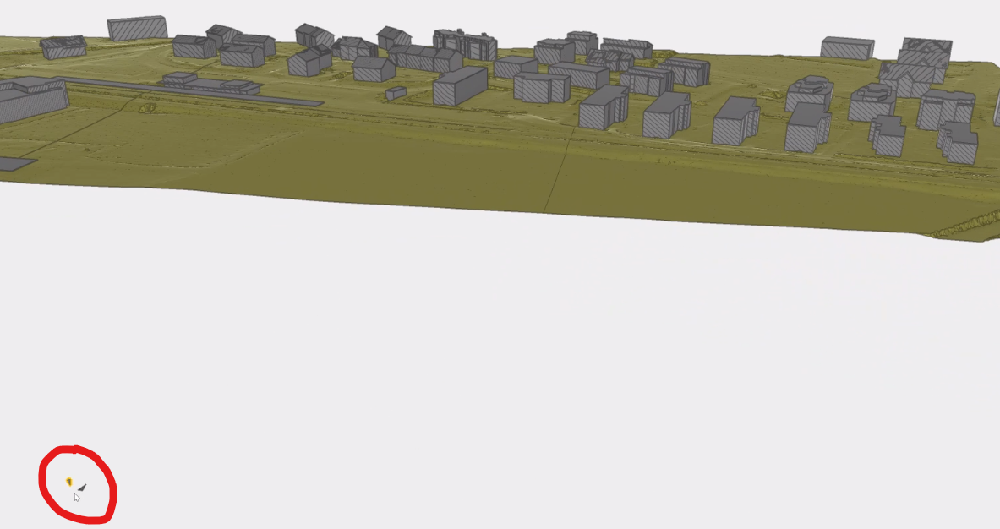
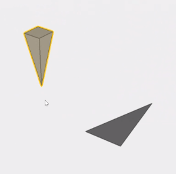

# Test dataset

| Test code | Test author     | Test dataset source | Test direction |
|-----------|-----------------|---------------------|----------------|
| PS01      | Stefan Jaud     | SBB                 | Export         |

## Content
- [Test dataset](#test-dataset)
  - [Content](#content)
  - [Model Dataset](#model-dataset)

## Model Dataset

This dataset is an example of what the project setup model could contain.

The project defines default units:

- *metre* as `LENGTHUNIT`
- *square metre* as `AREAUNIT`
- *cubic metre* as `VOLUMEUNIT`
- *degree* as `PLANEANGLEUNIT`
- *kilogram* as `MASSUNIT`
- *second* as `TIMEUNIT`
- *EUR* as monetary unit

The coordinate reference system is defined as:

- geodetic datum: CH1903+ ([EPSG:4150](https://epsg.io/4150)) 
- projected CRS: LV95 ([EPSG:2056](https://epsg.io/2056)) 
- vertical datum: LN02 ([EPSG:5728](https://epsg.io/5728))

The project's context's point of origin is defined relative to the CRS's point of origin with an offset:

- Easting: 2689000.0
- Northing: 1253000.0
- Elevation: 450.0

There is one `IfcBuildingElementProxy`:

- its id is `'3RhbhoXQ53yRzPOejOTUcp'`
- its name is *Punkte:Referenzpunkt:11547115*
- its tag is 11547115
- its geometry is a pyramid turned upside down, with base length 0.5, and height 1.5
- its position is at (relative to project's origin):
    - Easting: 700.000970772933
    - Northing: 1570.0
    - Elevation: 0.0

