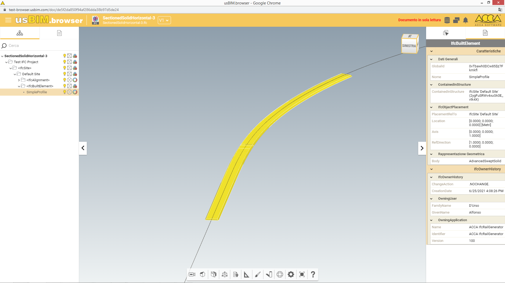

# SectionedSolidHorizontal-3

| Test code | Test author             | Test dataset source | Test direction |
|-----------|-------------------------|---------------------|----------------|
| SSH03     | Michelangelo Cianciulli | ACCA                | Export         |

## Intent
This scenario allows testing of a sectioned swept area solid. It uses the same profile from start to end but it has 3 CrossSectionPositions.

Main IFC concept templates involved in this test
 

- Project Global Positioning
- Alignment Layout
- Spatial Decomposition
- Spatial Containment
- Alignment Geometry
- Alignment Geometry Gradient
- Product Geometric Representation
- Body SectionedSolidHorizontal

## Prerequisites
None

## Test dataset (input)
This test case utilises the dataset collected in the Dataset folder and summarised in the table below.

| Filename(format)                   | Description                                                                                                                                                                                                               |
|------------------------------------|---------------------------------------------------------------------------------------------------------------------------------------------------------------------------------------------------------------------------|
| SectionedSolidHorizontal-3.ifc | **Reference IFC file**. Contains the definition of a sectioned solid horizontal with same profile from start to end and the use of 3 CrossSectionPositions |
| SectionedSolidHorizontal-3.png     | Screenshot of the IFC model                                                                                                                                                                                               |

## Validation criteria
:zap: For this test case to be considered passed, **all criteria listed in this section**, and **the ones of prerequisites tests** shall be verified. :zap:

### Formal rules
n.a.

### Informal criteria
n.a

### Expected geometry

### Control parameters
n.a.