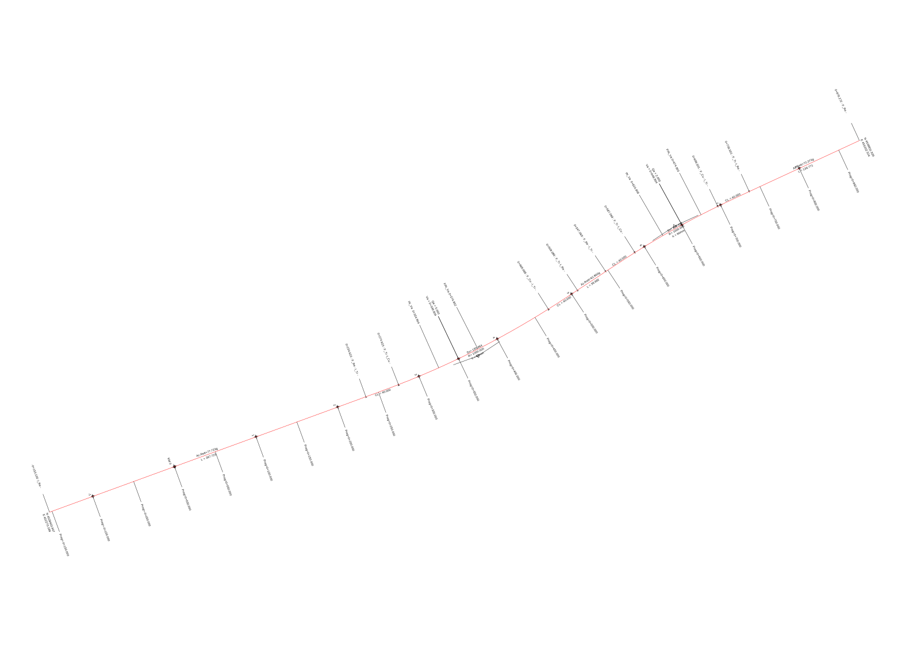
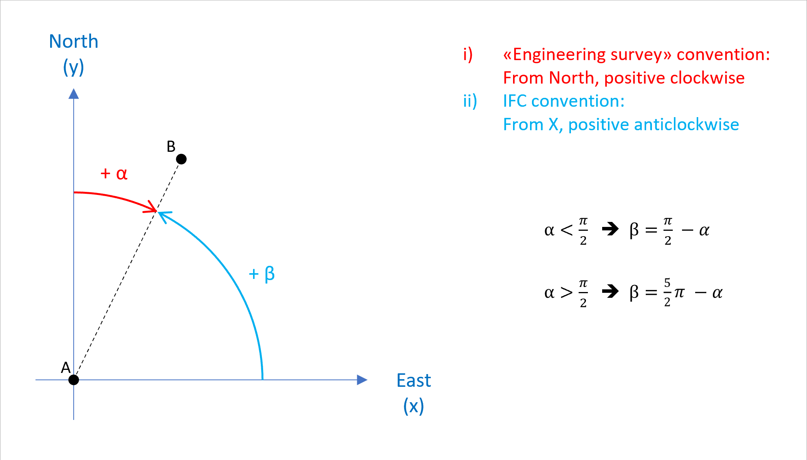
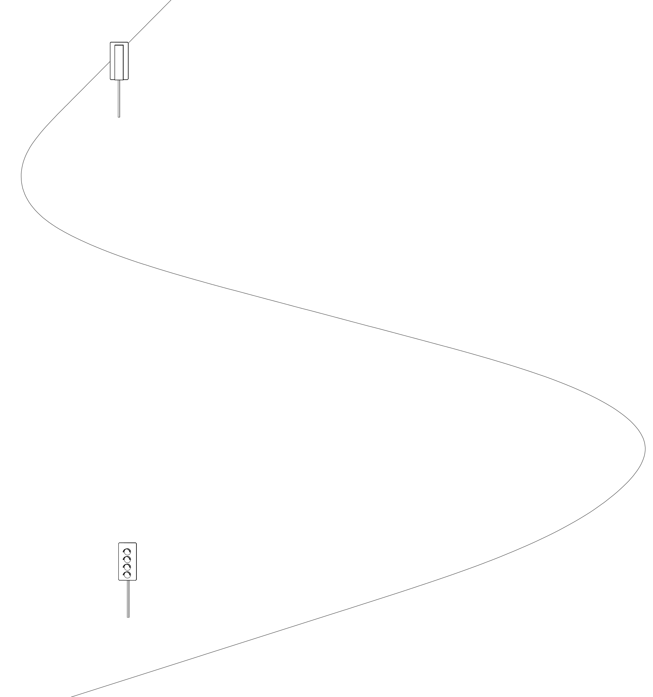
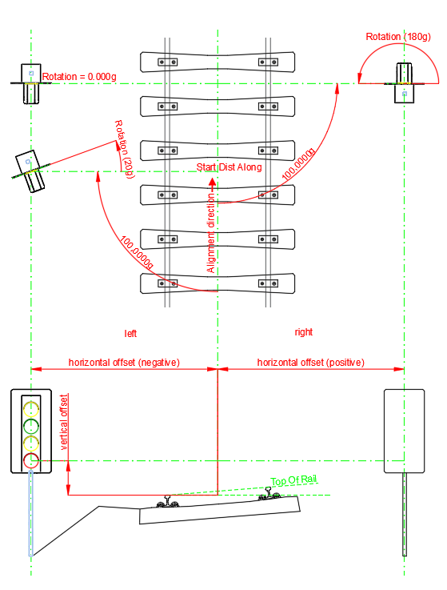
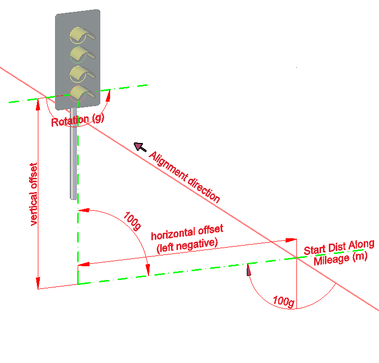

# BC002 Stationing on alignment dataset 01

| Test code | Test author     | Test dataset source | Test direction |
|-----------|-----------------|---------------------|----------------|
| STN01     | Ciro Vendrame   | RFI                 | Export         |

## Content

- [BC002 Stationing on alignment dataset 01](#bc002-stationing-on-alignment-dataset-01)
  - [Content](#content)
  - [Overview](#overview)
  - [Model Dataset](#model-dataset)
  - [Line layout](#line-layout)
  - [Alignment](#alignment)
    - [Alignment parameters for horizontal segments](#alignment-parameters-for-horizontal-segments)
    - [Alignment parameters for vertical segments](#alignment-parameters-for-vertical-segments)
    - [Alignment parameters for cant segments](#alignment-parameters-for-cant-segments)
  - [Signals](#signals)
    - [Signals shape](#signals-shape)
    - [Signals position parameters](#signals-position-parameters)
  - [Stationing](#stationing)
    - [Stationing values according to national conventions](#stationing-values-according-to-national-conventions)
    - [Stationing values of the horizontal segments](#stationing-values-of-the-horizontal-segments)
    - [Stationing values of the vertical segments](#stationing-values-of-the-vertical-segments)
    - [Stationing values of signals](#stationing-values-of-signals)
    - [Georeferencing](#georeferencing)

## Overview

| Info                         |                                           |
|------------------------------|-------------------------------------------|
| Number of alignment(s)       | 1                                         |
| Vertical Measurement         | Lower Rail                                |
| Properties of segments       | no                                        |
| Horizontal layout            | Line, Circular Arc, Clothoid              |
| Vertical layout              | Constant Gradient, Circular Arc           |
| Cant layout                  | Constant Cant, Linear Transition          |
| Broken chainage              | No                                        |
| Signals                      | 2                                         |
| IFC reference file available | # to check                                |

## Model Dataset
This dataset is an example of what the file “F02: IFC with alignment and signal” model could contain.
It represents one alignment with cant on which two signals are placed.

| Filename                                             | Description                                                                                       |
|------------------------------------------------------|---------------------------------------------------------------------------------------------------|
| [LineLayout](./LineLayout.svg)                       | Schematic [line layout](#Line-layout) of the test case                                            |
| [Alignment_horizontal](./Alignment_horizontal.csv)   | [Alignment parameters for horizontal segments](#Alignment-parameters-for-horizontal-segments)     |
| [Alignment_vertical](./Alignment_vertical.csv)       | [Alignment parameters for vertical segments](#Alignment-parameters-for-vertical-segments)         |
| [Alignment cant](./Alignment_cant.csv)               | [Alignment parameters for cant segments](#Alignment-parameters-for-cant-segments)
| [Alignment_exchange](./Alignment_exchange.xml)       |  Alignment description in xml
| [Alignment_2D_with_stationing_values](./Alignment_2D_with_stationing_values.dxf) | 2D model of the alignment with mileage referents
| [Alignment_3D_with_signals](./Alignment_3D_with_signals.dxf)       | 3D model of the alignment with 2 signals
| [Alignment_stationing_values_by_pace](./Alignment_stationing_values_by_pace.csv) | Alignment stationing values by pace
| [Alignment_stationing_values_by_segment_type](./Alignment_stationing_values_by_segment_type.csv) | Alignment stationing values by segment type
| [Signals_positions](./Signal_position.csv)           | [Signals positions parameters](#Position-parameters-for-signals)
| [Signals_stationing_values](./Signals_positions.csv) | [Signals stationing values](#Stationing-values-of-the-Signals) along the alignment
| [Geographic_Coordinate_System](./Geographic_Coordinate_System.pdf) | [Geographic Coordinate System properties](#Geographic-Coordinate-System-properties)

## Line layout

The line for the test is made of one alignment (*IfcAlignment*):

## Alignment

The **Alignment** is described through its **horizontal**, **vertical** and **cant** profiles.

Each profile is described using a CSV file.

<!-- All parameters of the segments, for both alignments, are detailed below in:-->

### Alignment parameters for horizontal segments

The horizontal profile is described using a CSV file and is made of the following 9 horizontal segments. The column headers match the IFC attributes for `IfcAlignmentHorizontalSegment`. Refers to the standard's documentation for their description.

| Entity                        | PredefinedType | Name | Start Point X | Start Point Y | Start Direction | Start Radius of Curvature | End Radius of Curvature | Segment Length |
|-------------------------------|----------------|------|---------------|---------------|-----------------|---------------------------|-------------------------|----------------|
| IfcAlignmentHorizontalSegment | LINE           | H1   | 452270,1883   | 4539403,9474  | 0,349924146     | 0                         | 0                       | 387,7233       |
| IfcAlignmentHorizontalSegment | CLOTHOID       | H2   | 452634,415    | 4539536,8692  | 0,349924146     | 0                         | 1000                    | 40             |
| IfcAlignmentHorizontalSegment | CIRCULARARC    | H3   | 452671,898    | 4539550,8322  | 0,369924153     | 1000                      | 1000                    | 193,4645       |
| IfcAlignmentHorizontalSegment | CLOTHOID       | H4   | 452844,4075   | 4539637,7367  | 0,563388612     | 1000                      | 0                       | 40             |
| IfcAlignmentHorizontalSegment | LINE           | H5   | 452877,9371   | 4539659,5475  | 0,583388619     | 0                         | 0                       | 38,9815        |
| IfcAlignmentHorizontalSegment | CLOTHOID       | H6   | 452910,4711   | 4539681,0207  | 0,583388619     | 0                         | -1000                   | 40             |
| IfcAlignmentHorizontalSegment | CIRCULARARC    | H7   | 452944,0007   | 4539702,8314  | 0,563388612     | -1000                     | -1000                   | 109,4317       |
| IfcAlignmentHorizontalSegment | CLOTHOID       | H8   | 453039,5298   | 4539756,1001  | 0,453956871     | -1000                     | 0                       | 40             |
| IfcAlignmentHorizontalSegment | LINE           | H9   | 453075,7086   | 4539773,1600  | 0,433956864     | 0                         | 0                       | 139,7711       |

**NOTE**:
- All distances are in meters
- All angles are in radian (see note below)
- All the coordinates are defined using the UTM Coordinate System (EPSG:3065)
- Positive values of *Radius of Curvature* imply a CCW direction whereas negative CW.

**IMPORTANT**:

When using IFC to exchange information, the file must respect IFC convention [marked as ii) in the figure below].
This implies a right-hand cartesian coordinate systems; and angles are measured from x-axis, counter clock-wise.

    

### Alignment parameters for vertical segments

The vertical profile is made of the following 5 vertical segments. The column headers match the IFC attributes for `IfcAlignmentVerticalSegment`. Refers to the standard's documentation for their description.

| Entity                      | PredefinedType   | Name | Start Dist Along | Horizontal Length | Start Height | Start Gradient | End Gradient | RadiusOfCurvature |
|-----------------------------|------------------|------|------------------|-------------------|--------------|----------------|--------------|-------------------|
| IfcAlignmentVerticalSegment | CONSTANTGRADIENT | V1   | 0                | 478,0045          | 5            | 0              | 0            |                   |
| IfcAlignmentVerticalSegment | CIRCULARARC      | V2   | 478,0045         | 49,9975           | 5            | 0              | -0,01        | 5000              |
| IfcAlignmentVerticalSegment | CONSTANTGRADIENT | V3   | 528,002          | 250,0037          | 4,75         | -0,01          | -0,01        |                   |
| IfcAlignmentVerticalSegment | CIRCULARARC      | V4   | 778,0057         | 49,9975           | 2,25         | -0,01          | 0            | -5000             |
| IfcAlignmentVerticalSegment | CONSTANTGRADIENT | V5   | 828,0032         | 201,3689          | 2            | 0              | 0            |                   |

**NOTE**:
- All distances are in meters.
- The radius (*Radius Of Curvature*) is considered positive when the curve is a crest (CCW direction), and negative when it is a sag  (CW direction).

### Alignment parameters for cant segments

The cant profile is made of the following 9 segments. The column headers match the IFC attributes for IfcAlignmentCantSegment. Refers to the standard's documentation for their description.

| Entity                  | PredefinedType   | Name | Start Dist Along | Horizontal Length | Start Cant left | End Cant left | Start Cant right | End Cant right |
|-------------------------|------------------|------|------------------|-------------------|-----------------|---------------|------------------|----------------|
| IfcAlignmentCantSegment | CONSTANTCANT     | C1   | 0                | 387,7233          | 0               | 0             | 0                | 0              |
| IfcAlignmentCantSegment | LINEARTRANSITION | C2   | 387,7233         | 40                | 0               | 0             | 0                | 0,06           |
| IfcAlignmentCantSegment | CONSTANTCANT     | C3   | 427,7233         | 193,4645          | 0               | 0             | 0,06             | 0,06           |
| IfcAlignmentCantSegment | LINEARTRANSITION | C4   | 621,1878         | 40                | 0               | 0             | 0,06             | 0              |
| IfcAlignmentCantSegment | CONSTANTCANT     | C5   | 661,1878         | 38,9815           | 0               | 0             | 0                | 0              |
| IfcAlignmentCantSegment | LINEARTRANSITION | C6   | 700,1693         | 40                | 0               | 0,06          | 0                | 0              |
| IfcAlignmentCantSegment | CONSTANTCANT     | C7   | 740,1693         | 109,4317          | 0,06            | 0,06          | 0                | 0              |
| IfcAlignmentCantSegment | LINEARTRANSITION | C8   | 849,601          | 40                | 0,06            | 0             | 0                | 0              |
| IfcAlignmentCantSegment | CONSTANTCANT     | C9   | 889,601          | 139,7711          | 0               | 0             | 0                | 0              |

**NOTE**:
- All distances are in meters.

## Signals

Two signals are placed along the alignment. They have the same shape. They are placed on the left and right side of the alignment and they face two opposite directions.

    

### Signals shape

The origin of the coordinates system of the signal is placed at the center of the red light (which is the lowest one) on the surface of the light panel.

    

### Signals position parameters

| # | Type of element | Distance Along | Offset Horizontal | Offset Vertical | Rotation         | Name               |
|---|-----------------|----------------|-------------------|-----------------|------------------|--------------------|
| 1 | SIGNAL          | 353,1000       | -3,0000           | 2,5000          | 0                | Route Indicator_01 |
| 2 | SIGNAL          | 853,1000       | 3,0000            | 2,5000          | 3,14159265358979 | Route Indicator_02 |

**NOTE**:
- All distances are in meters, all angles are in radian.
- The horizontal offset is negative when an element is placed at the left of the alignment, positive when is placed at the right.
- The vertical offset represents the distance between the signal origin and its vertical projection on the rail level (without cant). 
- The rotation is based on the line perpendicular to the alignment, is always positive and follows a CCW direction.

<!--
  
 
  
 -->

     

          
     

     

          
     

  

## Stationing

### Stationing values according to national conventions

The Italian national convention imposes to indicate at the beginning of the alignment the stationing value at the nearest value to a multiple of 50 meters, and then every 50 meters. In Figure 1, these values are indicated on the right side of the alignment. The values are the following: 

| #  | Type of element | Mileage |
|----|-----------------|---------|
| 1  | REFERENT        | -150    |
| 2  | REFERENT        | -100    |
| 3  | REFERENT        | -50     |
| 4  | REFERENT        | 0       |
| 5  | REFERENT        | 50      |
| 6  | REFERENT        | 100     |
| 7  | REFERENT        | 150     |
| 8  | REFERENT        | 200     |
| 9  | REFERENT        | 250     |
| 10 | REFERENT        | 300     |
| 11 | REFERENT        | 350     |
| 12 | REFERENT        | 400     |
| 13 | REFERENT        | 450     |
| 14 | REFERENT        | 500     |
| 15 | REFERENT        | 550     |
| 16 | REFERENT        | 600     |
| 17 | REFERENT        | 650     |
| 18 | REFERENT        | 700     |
| 19 | REFERENT        | 750     |
| 20 | REFERENT        | 800     |
| 21 | REFERENT        | 850     |

**NOTE**:
- All distances are in meters
    
### Stationing values of the horizontal segments

Railway designers are used to indicate the stationing values of the horizontal segments. In Figure 1, these values are indicated on the left side of the alignment.
The values are the following. In the table the type of segment and the segment length both refer to the horizontal segment only. 

| # | Type of segment | From (mileage) | To (mileage) | Segment Length |
|---|-----------------|----------------|--------------|----------------|
| 1 | LINE            | -153,1         | 234,6233     | 387,7233       |
| 2 | CLOTHOID        | 234,6233       | 274,6233     | 40             |
| 3 | CIRCULARARC     | 274,6233       | 468,0878     | 193,4645       |
| 4 | CLOTHOID        | 468,0878       | 508,0878     | 40             |
| 5 | LINE            | 508,0878       | 547,0693     | 38,9815        |
| 6 | CLOTHOID        | 547,0693       | 587,0693     | 40             |
| 7 | CIRCULARARC     | 587,0693       | 696,501      | 109,4317       |
| 8 | CLOTHOID        | 696,501        | 736,501      | 40             |
| 9 | LINE            | 736,501        | 876,2721     | 139,7711       |

**NOTE**:
- All distances are in meters

### Stationing values of the vertical segments

| # | Type of segment | From (mileage) | To (mileage) | Segment Length |
|---|-----------------|----------------|--------------|----------------|
| 1 | CIRCULARARC     | 324,9045       | 374,9020     | 49,9975        |
| 2 | CIRCULARARC     | 624,9057       | 674,9032     | 49,9975        |

**NOTE**:
- All distances are in meters

### Stationing values of signals

| # | Type of Element | Mileage | Name               |
|---|-----------------|---------|--------------------|
| 1 | SIGNAL          | 200     | Route Indicator_01 |
| 2 | SIGNAL          | 700     | Route Indicator_02 |

**NOTE**:
- All distances are in meters

### Georeferencing

| Coordinate System |                                       |
|-------------------|---------------------------------------|
| Name              | EPSG:3065                             |
| Description       | IGM95 / UTM zone 33N                  |
| Projection        | Transverse Mercator                   |
| EPSG Code         | 3065                                  |
| Source            | EPSG                                  |
| Units             | Meter                                 |
| Central Meridian  | 15°00’00.0000”E                       |
| Origin Latitude   | 00°00’00.0000”N                       |
| Scale Reduction   | 0.99960000                            |
| False Easting     | 500000.0000                           |
| False Northing    | 0.0000                                |
| Quadrant          | Positive X and Y                      |
| Minimum Longitude | 12°00’00.0000”E                       |
| Maximum Longitude | 18°31’48.0000”E                       |
| Minimum Latitude  | 36°36’00.0000”N                       |
| Maximum Latitude  | 47°05’24.0000”N                       |

| Datum             |                                       |
|-------------------|---------------------------------------|
| Name              | EPSG:6670                             |
| Description       | Istituto Geografico Militare 1995     |
| Source            | EPSG V6.12 operation EPSG:1098        |
| Conversion Method | Three Parameter Transformation        |
| Delta X           | 0.0000                                |
| Delta Y           | 0.0000                                |
| Delta Z           | 0.0000                                |

| Ellipsoid         |                                       |
|-------------------|---------------------------------------|
| Name              | EPSG:7030                             |
| Description       | WGS 84                                |
| Equatorial Radius | 6378137.0000                          |
| Polar Radius      | 6356752.3142                          |
| Eccentricity      | 0.0818                                |
| Source            | EPSG Version 6                        |

| Vertical Datum    |                                       |
|-------------------|---------------------------------------|
| Name              | EPSG:5214                             |
| Description       | Genoa height                          |
