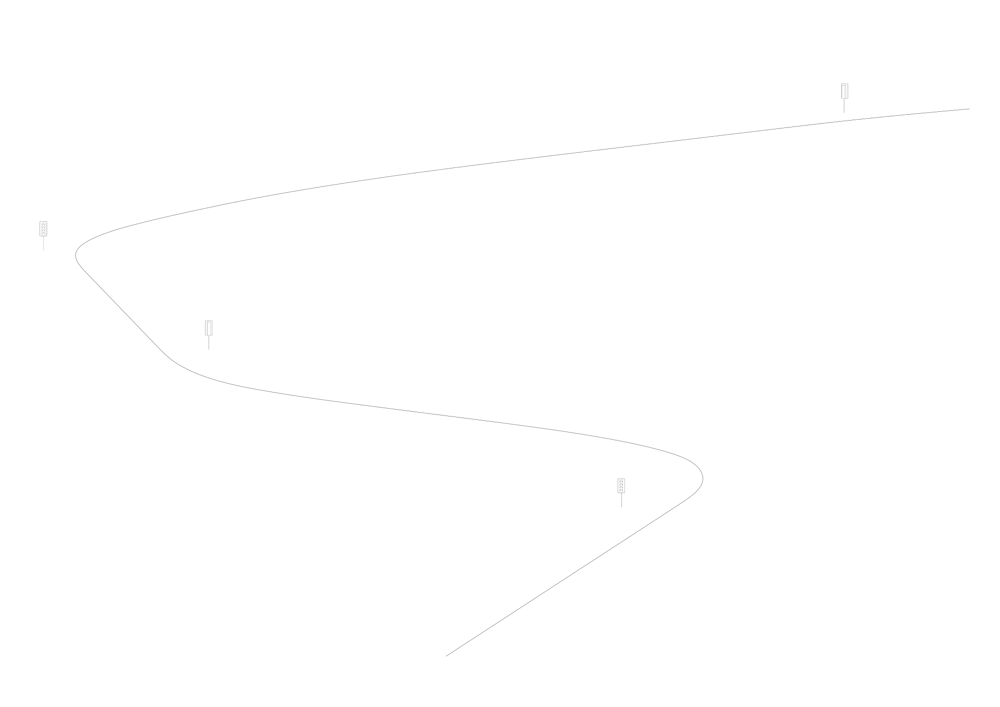
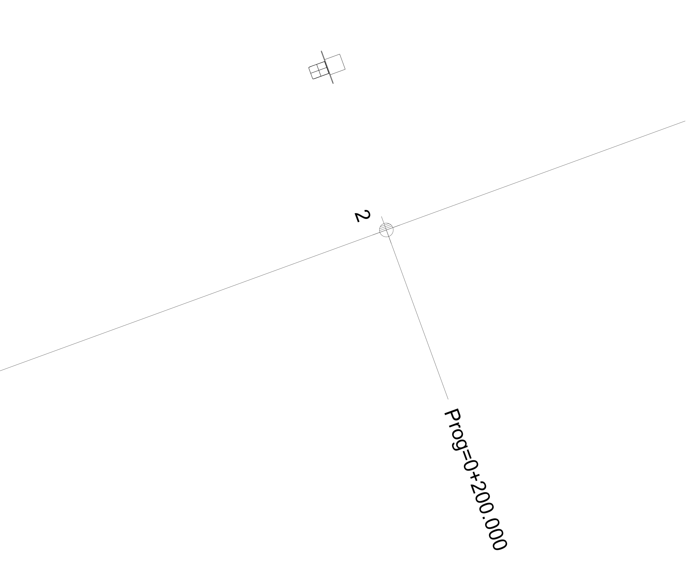
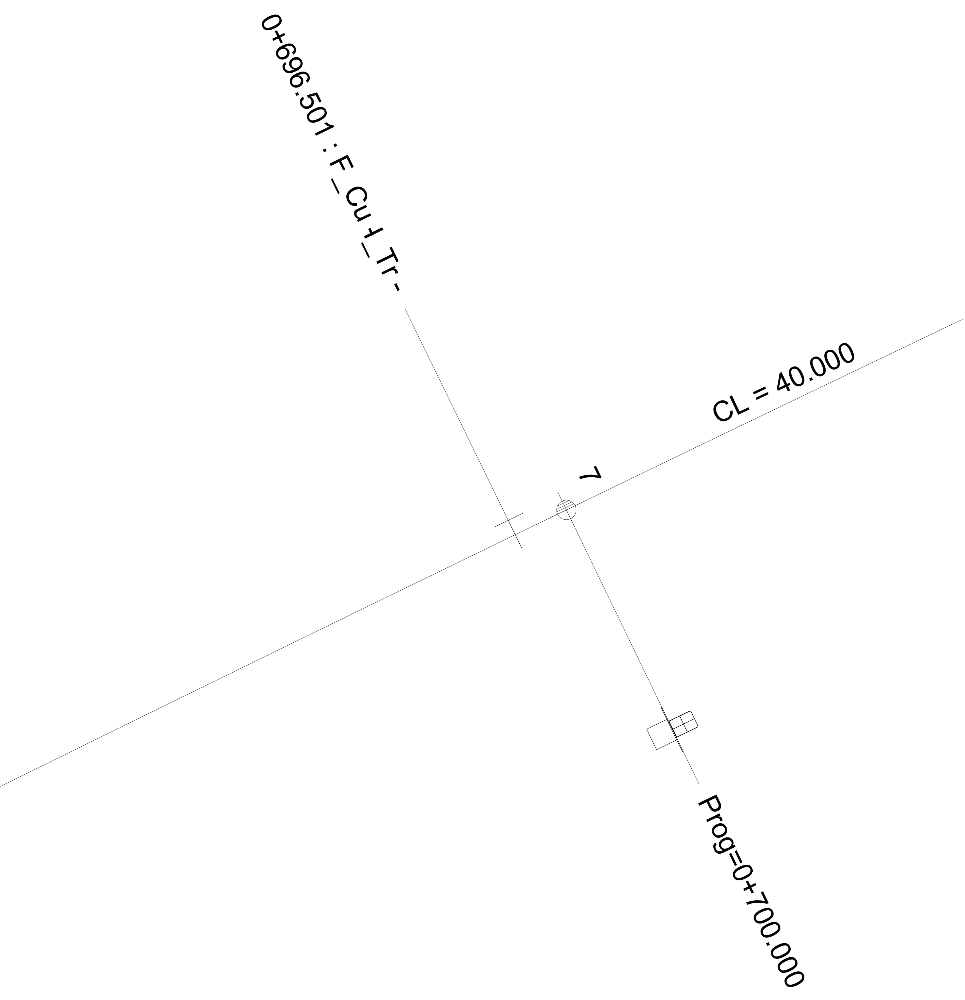
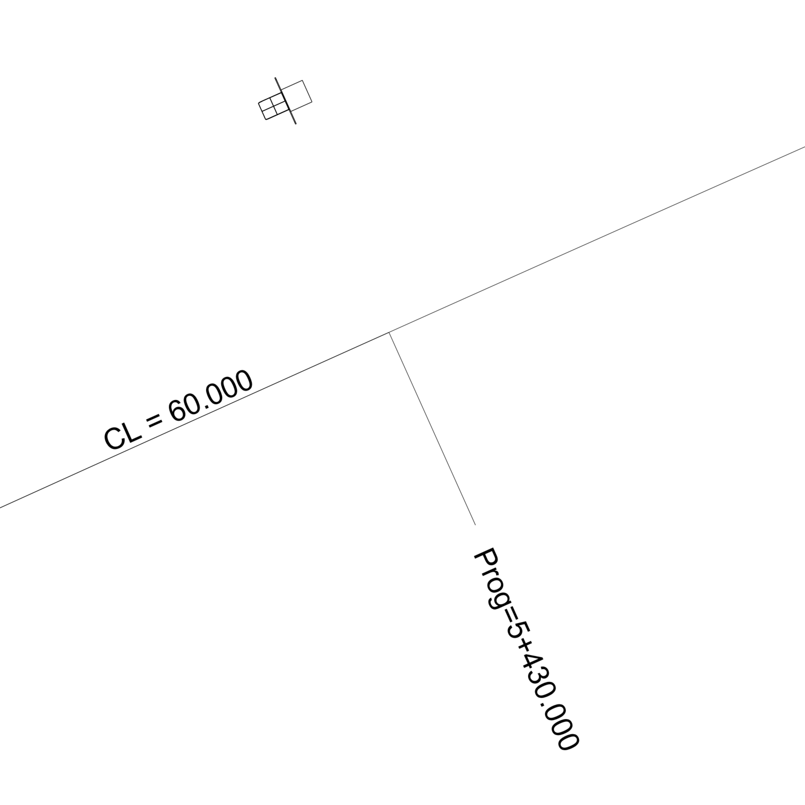
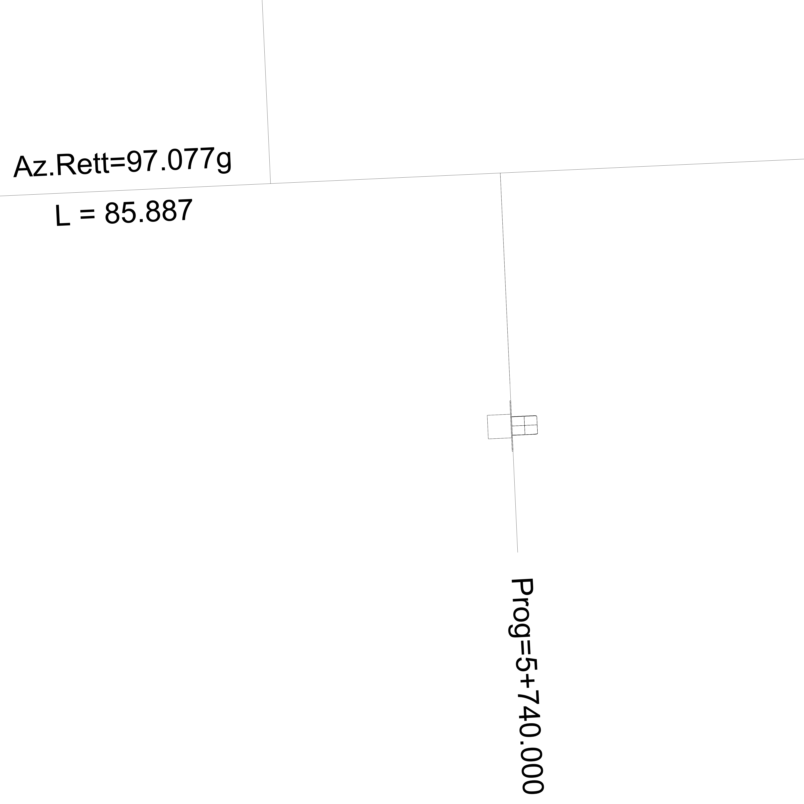

# Stationing on alignment with broken chainage

| Test code | Test author   | Test dataset source | Test direction |
|-----------| ------------- | ------------------- | -------------- |
| STN02     | Ciro Vendrame | RFI                 | Export         |

## Intent
This test case addresses the **export** of the required IFC entities for the exchange of data related to **Stationing on alignment with broken chainage**.

Main IFC concepts involved in this test
 

- Project Global Positioning
- Alignment Layout
- Spatial Decomposition
- Spatial Containment
- Alignment Geometry
- Alignment Geometry Gradient
- Alignment Geometry Cant
- Product Linear Placement
- Product Local Placement
- Product Shape 
- Referent Nesting
- Product Relative Positioning
- Element Decomposition
- Body Geometry

## Prerequisites
All validation criteria (and usages) of prerequisites' tests shall be **verified for this test too** (regression test principle). Prerequisites for the present test case are listed below.

| Test code | Test title                     | Comments |
| --------- | ------------------------------ | -------- |
| PJ01      | Project Setup                  | none     |
| GL01      | Global Positioning RFI dataset | none     |

## Test dataset (input)

This test case utilises the dataset collected in the Dataset folder and summarised in the table below. **For more details on each item see [Dataset description](Dataset/README.md).**

| Filename (format)                         | Description                                                     |
|-------------------------------------------|-----------------------------------------------------------------|
| LineLayout.svg                            | Schematic line layout of the test case                          |
| Alignment.xlsx                            | Alignment + chainage break parameters                           |                        |
| Alignment_STN02.xml                       | Alignment description in LandXML file format                    |
| Alignment_2D_with_stationing_values.dxf   | 2D CAD model of the alignment with mileage referents (dxf file) |
| Alignment_3D_with_signals.dxf             | 3D CAD model of the alignment with 2 signals (dxf file)         |
| Stationing_values.csv                     | Stationing values according to national conventions             |
| Stationing_values_horizontal_segments.csv | Stationing values of the horizontal segments                    |
| Stationing_values_vertical_segments.csv   | Stationing values of the vertical segments                      |
| Signal_3D.dxf                             | 3D CAD model of the signal (dxf file)                           |
| Signals_positions.csv                     | Signals positions parameters                                    |
| Stationing_values_signals.csv             | Stationing values of the signals                                |
| Geographic_Coordinate_System.pdf          | Geographic Coordinate System properties                         |

## Validation criteria

:zap: For this test case to be considered passed, **all criteria listed in this section**, and **the ones of prerequisites tests** shall be verified. :zap:

### Formal rules

#### IFC standard (schema and specification)

When validated using the bSI Validation Service, the IFC must pass:
- Syntax & Schema check
- All following rules:
  - ALB002 - Alignment layout (RI-6)
  - ALB003 - Alignment directions
  - TBD000 - Alignment shape representation (RI-5, RI-9, RI-10, RI-12, RI-14)
  - TBD000 - Stationing along alignment (RI-7)

#### Test case-specific checks

Covered by this IDS file: [STN02.ids](./Dataset/STN02.ids)

- (RI-18) Each IfcProduct (and subtypes) must have the attribute `Name` not null and not empty
- (RI-4) An IfcProject must have the attribute `Description` not null and not empty
- There must be 1 instance(s) of IfcAlignment and must be named `Track alignment`,its PredefinedType must be `USERDEFINED` and its ObjectType must be `Railway track alignment`
- There must be 1 instance(s) of IfcAlignmentHorizontal and must be named `H1`
- There must be 1 instance(s) of IfcAlignmentVertical and must be named `V1`
- There must be 1 instance(s) of IfcAlignmentCant and must be named `C1`
- There must be 4 instance(s) of IfcSignal and must be named `Route Indicator_01`, `Route Indicator_02`, `Route Indicator_03`, `Route Indicator_04`
- (RI-8) The horizontal layout must include only the following types of segments: Line, Circular Arc, Clothoid
  - (or one step closer to IFC) The PredefinedType of IfcAlignmentHorizontalSegment must be `LINE` or `CIRCULARARC` or `CLOTHOID`
- (RI-11) The vertical layout must include only the following types of segments: Constant Gradient, Circular Arc
- (RI-13) The cant layout must include only the following types of segments: Constant Cant, Linear Transition

Not covered by the IDS file (must be checked otherwise)
- (RI-19) An IfcSignal shall have 'Body' geometry
  
### Informal criteria

1. Check if the signals are facing opposite direction.
2. Check if the signals are placed on the correct side of the railway.
3. (RI-15) The start station of the alignment is *-153.1 m*
4. (RI-16) Check that the distance between one reference marker and the next one is 50 m, except for the first one

#### Signals are facing opposite direction

    

 

 Overall view of Route Indicator_01, Route Indicator_02, Route Indicator_03 and Route Indicator_04
 

 

#### Signals are placed on the correct side of the railway

    

 

 Route Indicator_01 top view
 

 

  

    

 

 Route Indicator_02 top view
 

  

  

    

 

 Route Indicator_03 top view
 

  

  

    

 

 Route Indicator_04 top view
 

  

### Expected geometry

      
    Expected geometry

### Control parameters

1. The total 2D length of the track alignment (horizontal projection) is 1458.5946 meters
2. The total 3D length of the track alignment is 1458.6178 meters
3. The ending point of the track alignment has coordinate (x, y, z) 453616.1646, 4539926.1049, 4.0000
4. The ending point of the track alignment has mileage (pk)	5+779.2225
5. The vertical height difference between starting and ending points of the track alignment 3D curve is -1.0000 meters

## Link to requirements

[BC-002 Requirements.xlsx](./Dataset/BC-002.xlsx)
