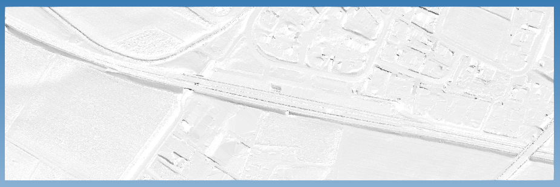
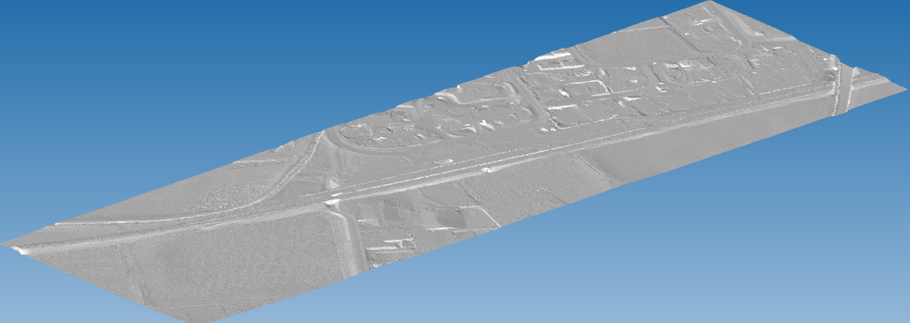

# Test dataset

| Test code | Test author     | Test dataset source | Test direction |
|-----------|-----------------|---------------------|----------------|
| PS01      | Stefan Jaud     | SBB                 | Export         |

## Model Dataset

This dataset is an example of what a terrain model could contain.

Additionally to the content of [PS01](../../PS01/Dataset/readme.md), there are four `IfcBuildingElementProxy`:

1. its id is `'2iFdMSmBP3L00000082LrB'`
  - its name is *Geländeoberfläche 01 (CD)*
  - its geometry is triangulated irregular network with 230215 faces
  - its position is at (relative to project's origin):
    - Easting: 0.0
    - Northing: 0.0
    - Elevation: 0.0

2. its id is `'2iFdMSmBP3L00000082Lsp'`
  - its name is *Geländeoberfläche 02 (CD)*
  - its geometry is triangulated irregular network with 232731 faces
  - its position is at (relative to project's origin):
    - Easting: 0.0
    - Northing: 0.0
    - Elevation: 0.0

3. its id is `'2iFdMSmBP3L00000082LsR'`
  - its name is *Geländeoberfläche 03 (CD)*
  - its geometry is triangulated irregular network with 233982 faces
  - its position is at (relative to project's origin):
    - Easting: 0.0
    - Northing: 0.0
    - Elevation: 0.0

4. its id is `'2iFdMSmBP3L00000082Ls3'`
  - its name is *Geländeoberfläche 04 (CD)*
  - its geometry is triangulated irregular network with 230920 faces
  - its position is at (relative to project's origin):
    - Easting: 0.0
    - Northing: 0.0
    - Elevation: 0.0

