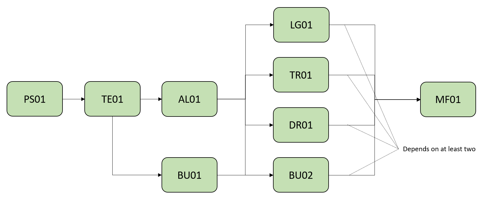
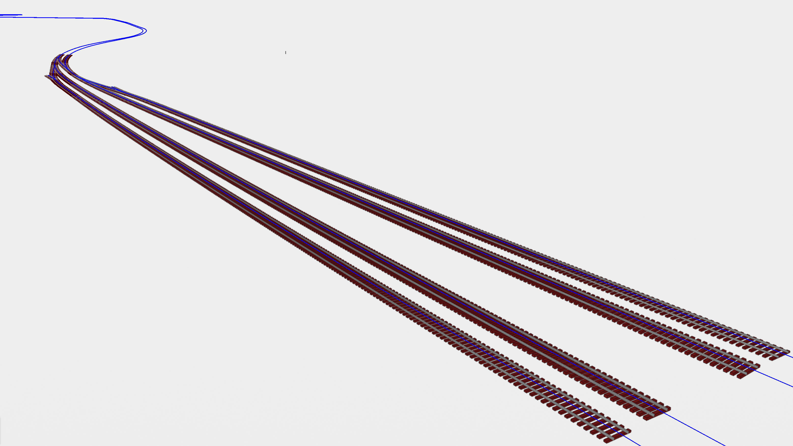

# TR01 - Track panels positioned along alignments

| Test code | Test author     | Test dataset source | Test direction |
|-----------|-----------------|---------------------|----------------|
| TR01      | Chi Zhang             | SBB                 | Export, Import         |

## Intent

This Test belongs to a series of Tests that share a dataset from the same project as a business case. 
The intention of this Business Case is to test how model federation works in the context of IFC 4.3. 
In particular we want to test the behaviour of objects that are located in relation to an alignemnt (for example a turnout within an alignment) and in relation to fixed coordinates (for example existing buildings) with georeferencing information set as the global context.
We would also like to test other essential concepts that are related to model federation like project break down structure (or to say, Spatial Structure) and revision and access control for elements.
The series of tests that belong to this Business Cases are listed as follows:

| Test code | Test name     | 
|-----------|-----------------|
| PS01      | Project setup with georeferencing |
| AL01  | Multiple alignments of railway line |
| LG01      | Loading gauge|
| **TR01**      | **Track panels positioned along alignments** |
| BD01      | Building and terrain as existing condition model |
| BD02      | Building positioned along alignment |
| MF01      | Model federation|

With this series of tests, we are attempting to build a step-by-step process to realize a business case.
The dependency between them are shown in the following diagram:

To perform a certain test in this series, developers can start from the very beginning (AKA. PS01) to build all the prerequisites independently, or based on outcomes from prerequisites tests.

This particular Test aims to test the implementation of track panels in IFC 4.3. It is based on the AL01, which defines multiple alignments, based on which track panels are placed. This test will test the linear placement of track panels, and their element decomposition structures and element types. The track panels created in this Test will be used as one domain model for model federation (MF01).

	
Main IFC concepts involved in this test
 

The concept templates that are focused by this series of tests are listed as follows. Specific concept templates that are focused by this test are in Bold.

- [Product Linear Placement](https://ifc43-docs.standards.buildingsmart.org/IFC/RELEASE/IFC4x3/HTML/concepts/Product_Shape/Product_Placement/Product_Linear_Placement/content.html)
- [Product Local Placement](https://ifc43-docs.standards.buildingsmart.org/IFC/RELEASE/IFC4x3/HTML/concepts/Product_Shape/Product_Placement/Product_Local_Placement/content.html)
- [Product Relative Positioning](https://ifc43-docs.standards.buildingsmart.org/IFC/RELEASE/IFC4x3/HTML/concepts/Object_Connectivity/Product_Relative_Positioning/content.html)
- [Element Decomposition](https://ifc43-docs.standards.buildingsmart.org/IFC/RELEASE/IFC4x3/HTML/concepts/Product_Shape/Product_Placement/Product_Local_Placement/content.html)
- [Revision Control](https://ifc43-docs.standards.buildingsmart.org/IFC/RELEASE/IFC4x3/HTML/concepts/Object_Attributes/Revision_Control/content.html)
- [Software Identity](https://ifc43-docs.standards.buildingsmart.org/IFC/RELEASE/IFC4x3/HTML/concepts/Object_Attributes/Software_Identity/content.html)

	
Recommended IFC concepts involved in this test
 

Optionally, these concepts templates should be applied in this Test.

- [Body AdvancedSwept Directrix Geometry](https://ifc43-docs.standards.buildingsmart.org/IFC/RELEASE/IFC4x3/HTML/concepts/Product_Shape/Product_Geometric_Representation/Body_Geometry/Body_AdvancedSweptSolid_Geometry/Body_AdvancedSwept_Directrix_Geometry/content.html)
- [Object Typing](https://ifc43-docs.standards.buildingsmart.org/IFC/RELEASE/IFC4x3/HTML/concepts/Object_Definition/Object_Typing/content.html)
- [Mapped Geometry](https://ifc43-docs.standards.buildingsmart.org/IFC/RELEASE/IFC4x3/HTML/concepts/Product_Shape/Product_Geometric_Representation/Mapped_Geometry/content.html)

	
Main software features involved in this series of tests
 

- Alignment visualization

## Test dataset (input)

The dataset is made of an IFC 2x3 file. It contains a section of railway line that have tracks consist of track panels and turnout panels, which are instantiated as IfcElementAssembly. Each track panel and turnout panel consists of rails and sleepers. Rails and sleepers are all instantiated as IfcBuildingElementProxy, which have the body representation of Brep or SweptSolid.

| Filename (format)         | Description                                                        |
|---------------------------|--------------------------------------------------------------------|
| [BC001_Track.ifczip](Dateset/BC001_Track.ifczip)    |    Data containing track panels in IFC 2x3 format                           |

In addition, the outcome of the Test AL01 shall be used as inputs of this Test.
## Validation criteria
⚡ For this test case to be considered passed, all criteria listed in this section, and the ones of prerequisites tests shall be verified. ⚡

### Formal rules
Formal Rules are those contained in the Gerkin documentation provided within the bSI validation system. In particular, the following list of rules will apply

#### IFC standard (schema and specification)
When validated using the bSI Validation Service, the IFC must pass:

- Syntax & Schema check
- All following rules:
  - EC001 - Each 'IfcElement' that is decomposed by components shall not have body representation.
  - EP001 - A product that is positioned based on an IfcPositioningElement shall be placed against the placement of the IfcPositioningElement.
  - EP003 - A compoent of an element shall not be directly positioned (IfcRelPositions) based on an IfcPositioningElement or be directly contained (IfcRelContainedInSpatialStructure) in an IfcSpatialStructureElement.

#### Test case-specific checks

Link to IDS file: STN01.ids 🚧

- (RI-18) Each track panel (IfcElementAssembly.TRACKPANEL) and turnout panel (IfcElementAssembly.TURNOUTPANEL) must have a Name.
- (RI-19) Each sleeper (IfcTrackElement.SLEEPER) and rail (IfcRail.RAIL) shall have 'Body' representation.
- (RI-60, RI-61) It is recommended that all 'Body' representations shall have extruded or swept solid geometry. It is acceptable to have tessellated geometry. All sleepers (IfcTrackElement.SLEEPER) shall have mapped geometry.
- (RI-21) Each track panel (IfcElementAssembly.TRACKPANEL) and turnout panel (IfcElementAssembly.TURNOUTPANEL) must have OwnerHistory assigned, which has OwningUser, OwningApplication, ChangeAction, CreationDate and State. The IfcOwnerHistory can be shared by multiple IfcElementAssembly if they have the same information, but the IfcOwnerHistory used by IfcElementAssembly shall be different with the ones used by IfcAlignment and IfcProject.
- (RI-15, RI-7) Each track panel (IfcElementAssembly.TRACKPANEL) and turnout panel (IfcElementAssembly.TURNOUTPANEL) must be decomposed by rails (IfcRail.RAIL) and sleepers (IfcTrackElement.SLEEPER).

### Informal criteria
The following steps should be performed in order to corroborate that the software is working as expected:

- All track panels shall be visualized in 3D.
- The hierarchy of the model shall be:
 - IfcProject
  - IfcAlignment
  - IfcSite.Name='DORF-BSD'
  - IfcRailway.Name='RL'
   - IfcRailwayPart.TRACKSTRUCTUREPART.Name='TRCK'
    - IfcElementAssembly.TRACKPANEL
     - IfcTrackElement.SLEEPER
     - IfcRail.RAIL
    - IfcElementAssembly.TURNOUTPANEL
     - IfcTrackElement.SLEEPER
     - IfcRail.RAIL

### Expected geometry
>:information_source: *add image of the expected geometry. Upload the jpeg/png file in the Dataset folder of this test*

### Control parameters
>:information_source: *add parameters/data that can be use to support the validation of import into a receiving application. Example: total length of one alignment, coordinates for end point of the alignment.*

| Track Panel        | Alignment | StartDistAlong | ending point | vertical height difference |
|------------------|-----------|-----------|--------------|----------------------------|
|   A50034A        |           |           |              |                            |
|   A50068A        |           |           |              |                            |
|   A50113A        |           |           |              |                            |
|   A50114A        |           |           |              |                            |
|   A50115A        |           |           |              |                            |
|   A50116A        |           |           |              |                            |
|   A50117A        |           |           |              |                            |
|   A50118A        |           |           |              |                            |
|   A50119A        |           |           |              |                            |
|   A50120A        |           |           |              |                            |
|   A50121A        |           |           |              |                            |

### Link to requirements
>:information_source: *list requirements covered by this test, or refer to external documentation*

...
