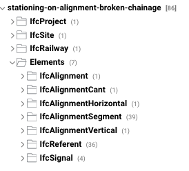
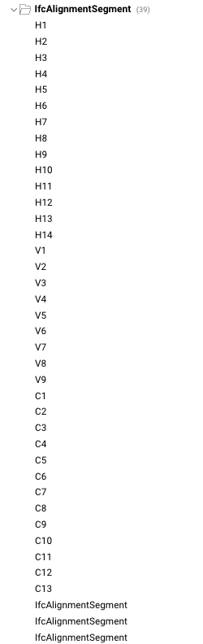
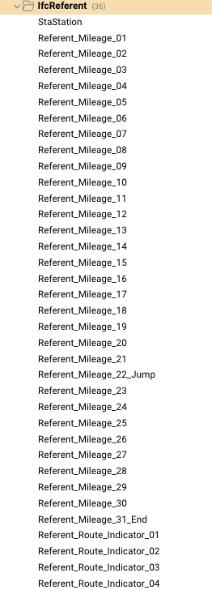
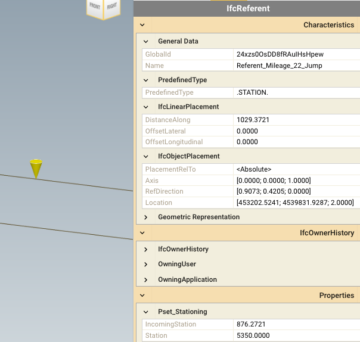
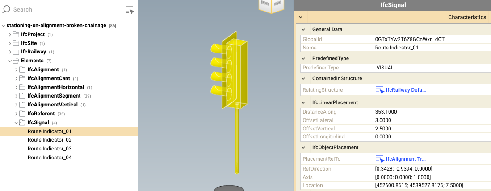
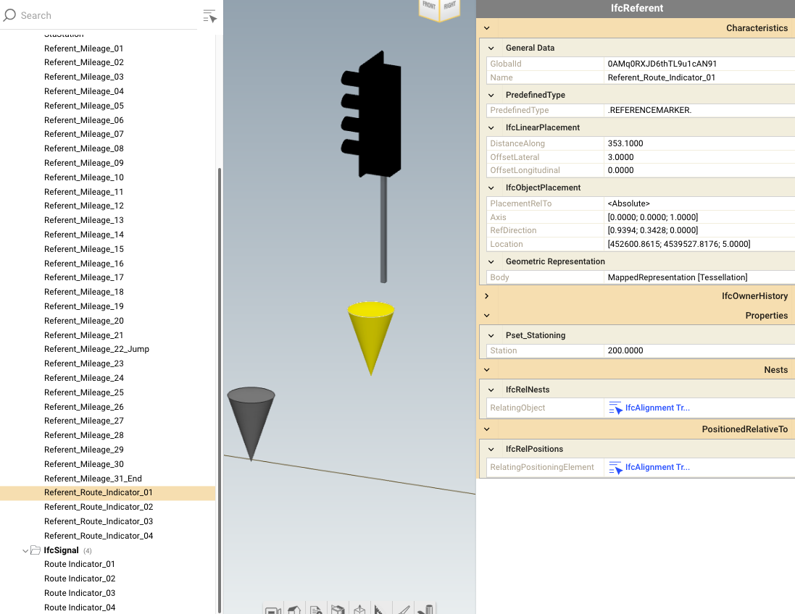
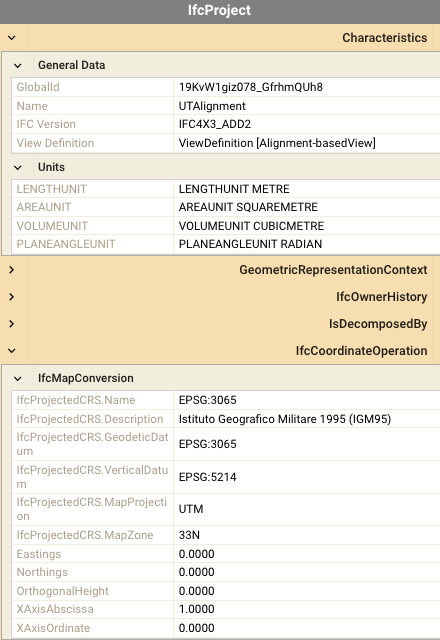

# Success Record

**Test**: stationing-on-alignment-broken-chainage

**Software Company**: Acme Inc.
**Application Name**: TNT BIM 2
**Application Version Tested**	v.2.18
**Test date**: April 15, 2026

## Verification checklist

**Alignment business logic**

1. all three layouts (horizontal, vertical, cant) of alignment are present
1. all horizontal segments are present (14)
1. all vertical segments are present (9)
1. all cant segments are present (13)

> 

**Alignment representation**

1. all three layouts (horizontal, vertical, cant) of alignment are present
1. all horizontal segments are present (14, 4 straight lines and 3 circular arcs, each one with 2 transitions)
1. all vertical segments are present (10)
1. all cant segments are present (14)

> 

**Referents**
1. 36 referents are present (34 REFERENCEMARKER and 2 STATION)
1. stationing pace is 50 m
1. starting station is -153.100 m 
1. after the 21st marker (Name: Referent_Mileage_21) there is a stationing jump (broken chainage). IncomingStation is 876.2721 m, Station is 5,350.0000 (or 5+350.0000), DistanceAlong is 1,029.3721, (**X**: 453,202.5241; **Y**: 4,539,831.9287; **Z**: 2.0)
1. ending station is 5,779.2225 m

> 

> 

**Linear placement**

1. four signals are placed along the alignment. They are all IfcSignal of type VISUAL, and have the same shape.
1. two signals are placed on the left and two on the right side of the alignment.
1. two signals (1st, 3rd) face the start of the alignment, two (2nd and 4th) face the end of the alignment.
1. stationing values of the signals are, respectively: 200; 700; 5+430.0; and 5+740.0

> 

> 

**Georeferencing**

1. CRS is EPSG:3065
1. vertical datum is EPSG:5214

> 